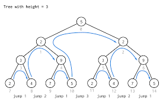

# :heavy_check_mark: Tree Depth First Search
*Last Updated: 2/12/2023*

## :round_pushpin: Introduction
- Based on the `Depth First Search (DFS)` technique to traverse a tree.
- Using recursion (or can have stack).
- The space complexity is `O(H)` where `H` is the maximum height of the tree.

## :round_pushpin: Requirements
- Calculating the accumulation of something.
- Usually involves a path.

## :round_pushpin: Leetcode Problems 

- [x] 104. [Maximum Depth of Binary Tree (Easy)](https://leetcode.com/problems/maximum-depth-of-binary-tree/)
- [x] 112. [Path Sum (Easy)](https://leetcode.com/problems/path-sum/)
- [ ] 113. [Path Sum II (Medium)](https://leetcode.com/problems/path-sum-ii/)
- [ ] 114. [Flatten Binary Tree to Linked List (Medium)](https://leetcode.com/problems/flatten-binary-tree-to-linked-list/)
- [ ] 124. [Binary Tree Maximum Path Sum (Hard)](https://leetcode.com/problems/binary-tree-maximum-path-sum/)
- [ ] 129. [Sum Root to Leaf Numbers (Medium)](https://leetcode.com/problems/sum-root-to-leaf-numbers/)
- [ ] 226. [Invert Binary Tree (Easy)](https://leetcode.com/problems/invert-binary-tree/)
- [ ] 257. [Binary Tree Paths (Easy)](https://leetcode.com/problems/binary-tree-paths/)
- [ ] 297. [Serialize and Deserialize Binary Tree (Hard)](https://leetcode.com/problems/serialize-and-deserialize-binary-tree/)
- [ ] 437. [Path Sum III (Medium)](https://leetcode.com/problems/path-sum-iii/)
- [ ] 543. [Diameter of Binary Tree (Easy)](https://leetcode.com/problems/diameter-of-binary-tree/)
- [ ] 1430. [Check If a String Is a Valid Sequence from Root to Leaves Path in a Binary Tree (Medium)](https://leetcode.com/problems/check-if-a-string-is-a-valid-sequence-from-root-to-leaves-path-in-a-binary-tree/)

## :round_pushpin: Sources
*List to be updated...*
