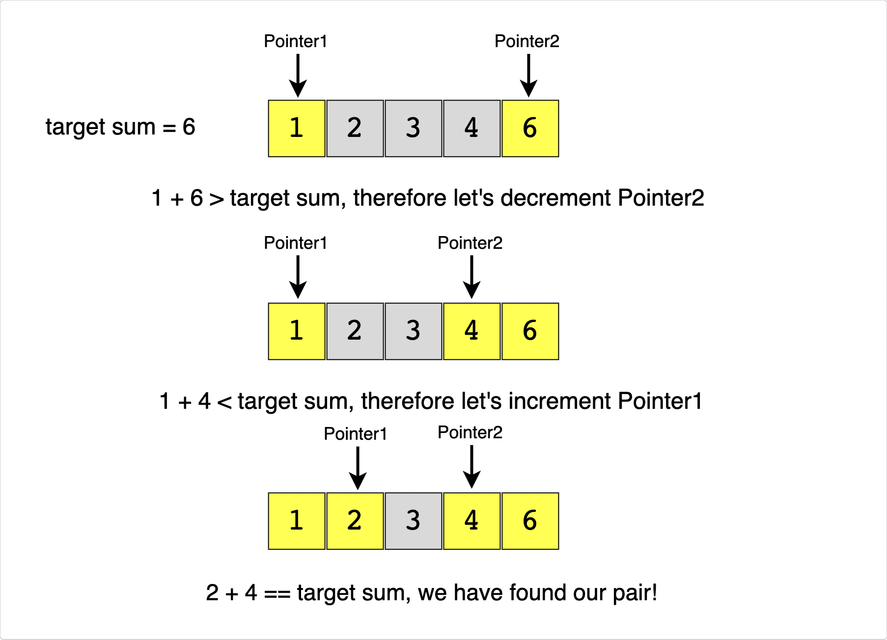

# :heavy_check_mark: Two Pointers
*Last Updated: 2/8/2023*


## :round_pushpin: Introduction
In problems where we deal with sorted arrays (or Linked Lists) and need to find a set of elements that fulfill certain constraints, the `Two Pointers` approach is useful.

The set of elements can be a pair, a triplet, or even a subarray.

Typically used for searching pairs in a sorted array (search algorithm).

Can use to detect cycles in a Linked List.

Can be used to reverse something as well.

***NOTE:*** Two pointers may also start from the same end.

## :round_pushpin: Requirements
- The arrays or lists usually have an order to them.

## :round_pushpin: Types
- Slow and Fast Pointers

## :round_pushpin: Recognition
- Involves collections like arrays or lists.
- Ordered.

## :round_pushpin: Example
Take a look at this example:
```
Given an array of sorted numbers and a target sum, find a pair in the array whose sum is equal to the given target.
```

### Brute-Force Approach
We can consider each element one by one (pointed out by the first pointer) and iterate through the remaining elements (pointed out by the second pointer) to find a pair with the given sum.

```java
public static int isPairSum(int[] arr, int target) {
  for (int i = 0; i < arr.length - 1; i++) {
    for (int j = i + 1; j < arr.length; j++) {
      // Check if it equals target.
      if (arr[i] + arr[j] == target) {
        return 1;
      }

      // If the sum of the pairs exceeds target, it means there's no way
      // there'll be a pair since they're all sorted.
      if (arr[i] + arr[j] > target) {
        break;
      }
    }
  }

  // No pair found.
  return 0;
}
```
**Time Complexity:** The time complexity of this algorithm is <code>O(N<sup>2</sup>)</code> where `N` is the number of elements in the input array.

### Efficient Approach
It's given that the input array is sorted.

An efficient way would be to start with one pointer in the beginning and another pointer at the end. At every step, we will see if the numbers pointed by the two pointers add up to the target sum.

If not, do one of two things:
1. If the sum of the two numbers pointed by the two pointers is greater than the target sum, we need a pair with a smaller sum. So, try more pairs by decrementing the end pointer.
2. If the sum of the two numbers pointed by the two pointers is smaller than the target sum, we need a pair with a larger sum. So, try more pairs by incrementing the start pointer.



**Time Complexity:** `O(N)` where `N` is the number of elements in the input array.
```java
public static int isPairSum(int[] arr, int target) {
  // Make two pointers on both ends.
  int i = 0;
  int j = arr.length - 1;

  // Move them inwards until they meet.
  while (i < j) {
    if (arr[i] + arr[j] == target) {
      return 1;
    } else if (arr[i] + arr[j] < target) {
      i++;
    } else {
      j--;
    }
  }

  // No pair found.
  return 0;
}
```

## :round_pushpin: Leetcode Problems 

- [x] 1. [Two Sum (Easy)](https://leetcode.com/problems/two-sum/)
  - This problem is actually a Hash Map/Table problem.
  - I only added this problem because, IF ORIGINALLY SORTED, we can use two pointers on both ends.
  - See problem #167 below.
- [x] 15. [3Sum (Medium)](https://leetcode.com/problems/3sum/)
- [x] 16. [3Sum Closest (Medium)](https://leetcode.com/problems/3sum-closest/)
- [x] 18. [4Sum (Medium)](https://leetcode.com/problems/4sum/)
- [x] 26. [Remove Duplicates from Sorted Array (Easy)](https://leetcode.com/problems/remove-duplicates-from-sorted-array/description/)
- [x] 27. [Remove Element (Easy)](https://leetcode.com/problems/remove-element/)
- [x] 75. [Sort Colors (Medium)](https://leetcode.com/problems/sort-colors/)
- [x] 80. [Remove Duplicates from Sorted Array II (Medium)](https://leetcode.com/problems/remove-duplicates-from-sorted-array-ii/)
- [x] 88. [Merge Sorted Array (Easy)](https://leetcode.com/problems/merge-sorted-array/)
- [ ] 151. [Reverse Words in a String (Medium)](https://leetcode.com/problems/reverse-words-in-a-string/)
- [x] 167. [Two Sum II - Input Array Is Sorted (Medium)](https://leetcode.com/problems/two-sum-ii-input-array-is-sorted/description/)
- [x] 170. [Two Sum III - Data Structure Design (Easy)](https://leetcode.com/problems/two-sum-iii-data-structure-design/)
- [x] 259. [3Sum Smaller (Medium)](https://leetcode.com/problems/3sum-smaller/)
- [x] 283. [Move Zeroes (Easy)](https://leetcode.com/problems/move-zeroes/)
- [x] 581. [Shortest Unsorted Continuous Subarray (Medium)](https://leetcode.com/problems/shortest-unsorted-continuous-subarray/)
- [ ] 680. [Valid Palindrome II (Easy)](https://leetcode.com/problems/valid-palindrome-ii/)
- [x] 821. [Shortest Distance to a Character](https://leetcode.com/problems/shortest-distance-to-a-character/)
- [x] 844. [Backspace String Compare (Easy)](https://leetcode.com/problems/backspace-string-compare/)
- [x] 977. [Squares of a Sorted Array(Easy)](https://leetcode.com/problems/squares-of-a-sorted-array/)
- [x] 1099. [Two Sum Less Than K (Easy)](https://leetcode.com/problems/two-sum-less-than-k/)
- [x] 1679. [Max Number of K-Sum Pairs (Medium)](https://leetcode.com/problems/max-number-of-k-sum-pairs/)
- [x] 1711. [Count Good Meals (Medium)](https://leetcode.com/problems/count-good-meals/)
  - This is actually a map/set problem.
- [x] 2367. [Number of Arithmetic Triplets (Easy)](https://leetcode.com/problems/number-of-arithmetic-triplets/)
- [x] 2395. [Find Subarrays With Equal Sum (Easy)](https://leetcode.com/problems/find-subarrays-with-equal-sum/)
  - I believe this problem is a Sliding Window problem, but I'll just leave this here.
- [x] 2399. [Check Distances Between Same Letters (Easy)](https://leetcode.com/problems/check-distances-between-same-letters/)
  - This is not a two pointers problem. I think this is a map/set problem.
- [x] 2441. [Largest Positive Integer That Exists With Its Negative (Easy)](https://leetcode.com/problems/largest-positive-integer-that-exists-with-its-negative/)
  - This is not a two pointers problem. I think this is a map/set problem.
- [x] 2465. [Number of Distinct Averages (Easy)](https://leetcode.com/problems/number-of-distinct-averages/)
- [x] 2491. [Divide Players Into Teams of Equal Skill (Medium)](https://leetcode.com/problems/divide-players-into-teams-of-equal-skill/)

## :round_pushpin: Sources
*List to be updated...*
