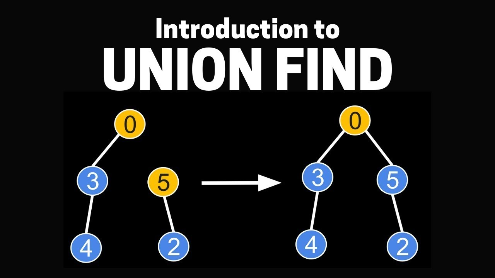

# :heavy_check_mark: Union Find
*Last Updated: 2/13/2023*

## :round_pushpin: Introduction
- A data structure that keeps track of a set of elements *partitioned* into a number of disjoint (non-overlapping) subsets.
- Also called `Disjoint-Set Data Structure` or `Union-Find Data Structure`.
- Stores a collection of disjoint sets.
- It stores a partition of a set into disjoint subsets.
- Provides operations for adding new sets, merging sets, and finding a representative member of a set.

## :round_pushpin: Operations
A `Union-Find Algorithm` is an algorithm that performs two useful operations on such a data structure:
  1. **Find:** Determine which subset a particular element is in. This can be used for determining if two elements are in the same subset.
  2. **Union:** Join two subsets into a single subset. First we have to check if two subsets belong to the same set. If not, we cannot perform union.

## :round_pushpin: Leetcode Problems 

- [ ] 200. [Number of Islands (Medium)](https://leetcode.com/problems/number-of-islands/)
- [ ] 399. [Evaluate Division (Medium)](https://leetcode.com/problems/evaluate-division/)
- [ ] 684. [Redundant Connection (Medium)](https://leetcode.com/problems/redundant-connection/)
- [ ] 924. [Minimize Malware Spread (Hard)](https://leetcode.com/problems/minimize-malware-spread/)
- [ ] 959. [Regions Cut By Slashes (Medium)](https://leetcode.com/problems/regions-cut-by-slashes/)
- [ ] 1970. [Last Day Where You Can Still Cross (Hard)](https://leetcode.com/problems/last-day-where-you-can-still-cross/)

## :round_pushpin: Sources
*List to be updated...*
