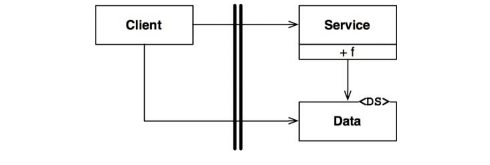
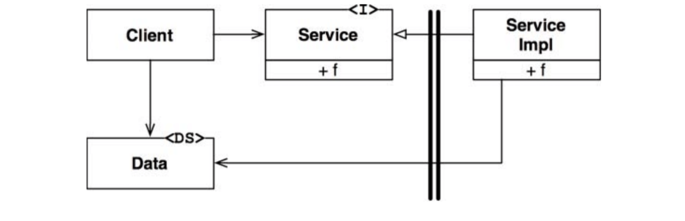

# :heavy_check_mark: Boundary Anatomy

## :round_pushpin: Introduction
The architecture of a system is defined by the components and the boundaries that separate them. Those boundaries come in different forms.

## :round_pushpin: Boundary Crossing
At runtime, boundary crossing is when a function on one side calls a function on the other side while passing data. To create an appropriate boundary crossing, we have to manage the source code dependencies.

This is because when one code module changes, other code modules may change or recompile. Managing and building firewalls *against* this change is what boundaries are all about.

## :round_pushpin: The Dreaded Monolith
The simplest and common architectural boundary has no no strict physical representation. It is a separation of functions and data within a single processor and a single address space. This is source-level decoupling mode.

From deployment point of view, this is just a single executable file. This is the monolith.

The boundaries are not visible during deployment, but it does not mean they are *not* there.

These architectures depend on dynamic polymorphism to manage internal dependencies.

The simplest boundary crossing is a function call from a low-level client to a high-level service. The runtime dependency and compile-time dependency point towards the high-level component. See the image below.

In the image, the flow goes from left to right across the boundary. The `Client` calls function `f()` on `Service`. It passes `Data`. The `<DS>` marker indicates a data structure. Notice that `Data` is on the *called* side.

If a high-level client needs to call a function on the low-level service, dynamic polymorphism is used to invert dependency against flow of control. The runtime dep opposes the compile-time dep. See the image.

The flow of control is left to right (same as before). The high-level `Client` calls `f()` function of lower-level `ServiceImpl` through the `Service` interface. All deps cross from right to left *toward the higher-level component*. The definition of data structure is on the *calling* side.

Communication between components in a monolith is fast. The deployment of monoliths require compilation and static linking, so they are typically delivered as source code.

## :round_pushpin: Deployment Components
Simplest physical representation of architectural boundary is a dynamically linked library. Deployment does not involve compilation. Components are delivered in binary. This is deployment-level decoupling mode. The act of deployment is the act of gathering these deployable units together in some convenient form.

With that exception, deployment-level components are like monoliths.

## :round_pushpin: Threads
Both monoliths and deployment components use threads. They are a way to organize the schedule and order of execution. They may be in a component or spread across many.

## :round_pushpin: Local Processes
A much stronger architectural boundary is the local process. Typically created with command line or system call.

They communicate with sockets or some other OS communications facility.

Each local process may be a statically linked monolith or be composed of dynamically linked deployment components.

A local process is like an uber-component: The process has lower-level components that manage their dependencies through dynamic polymorphism.

Segregation between local processes is the same as for monoliths. Code deps should point towards higher-level components.

## :round_pushpin: Services
The strongest boundary is a service.

It is generally started from the command line or sys calls. Services can be anywhere and do not really share space. They communicate over the network.

Communication is slower compared to function calls. There are different levels of latency.

The same rules apply to services as well. Lower-level services should "plug in" to higher-level services. The code in higher-level services must not contain knowledge of lower-level services.
