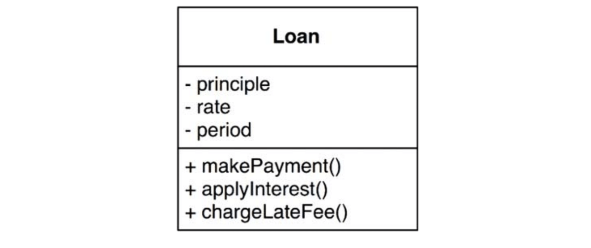

# :heavy_check_mark: Business Rules

## :round_pushpin: Introduction
It's a good idea to know what business rules actually are. There are several kinds.

They are rules or procedures that would make or save the business money. These rules do not have to be implemented on a computer.

A bank that charges *N*% interest for a loan is a business rule whether this is calculated on a computer or the banker manually does it. We call these rules `Critical Business Rules` because they are critical to the business itself, and it would exist if there were no system to automate them.

Our critical business rule needs data to work with. We call this `Critical Business Data`. This is the data that would exist even if the system was not automated.

These two are good candidates for an object. We call this object an `Entity`.

## :round_pushpin: Entities
An `Entity` is an object in our system that groups a set of critical business rules operation on critical business data. This object either has the data or has access to the data. The interface has functions that implement the rules that operate on the data.

See the example below. We have a UML of `Loan` entity. It has three data and three rules as its interface.

We are gathering software that implements a concept critical to business. We are separating it from every other concern. It does not care about databases, frameworks, or UIs. It is pure business.

## :round_pushpin: Use Cases
Some business rules save and make money by *constraining* the way a system operates. They make sense only in the automated system.

Imagine the banking scene. In order to give loans, bankers need to verify the credit score, personal info, etc. There needs to be an enforcement that prevents loan disbursement *until* these conditions are met.

This is a *use case*. A use case is a description of the way the automated system is used. A use case describes *application-specific* business rules rather than critical business rules in entities.

Use cases have rules that tell us when the critical business rules within entities can be used. Use cases control the dance of entities.

We cannot tell the medium of data input/output from the use case. This is important. Use cases should not describe how the system appears to the user. It should not care about *how* data gets in or out.

Use case is an object. It has one or more functions that implement app-specific rules. It also has data.

Entities have no knowledge of the use cases. High-level concepts like Entities know nothing about use case. Use cases know about entities.

Why are entities high-level and use cases low-level? Because the use cases are closer to the inputs/outputs. Entities are generalizations that can be used in many apps. They are farther from the input/output. Use cases depend on Entities. Not the other way around.

## :round_pushpin: Request and Response Models
Use cases expect input and output data, but use case objects should not know how the data is communicated (HTML or SQL).

This lack of dependencies is critical.
