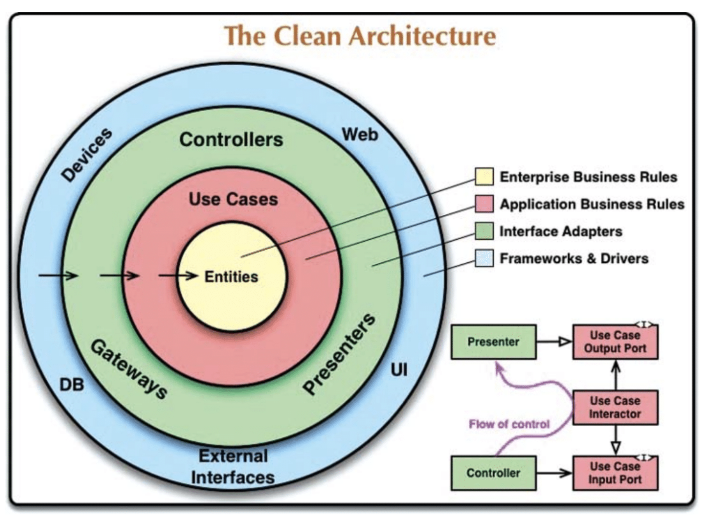
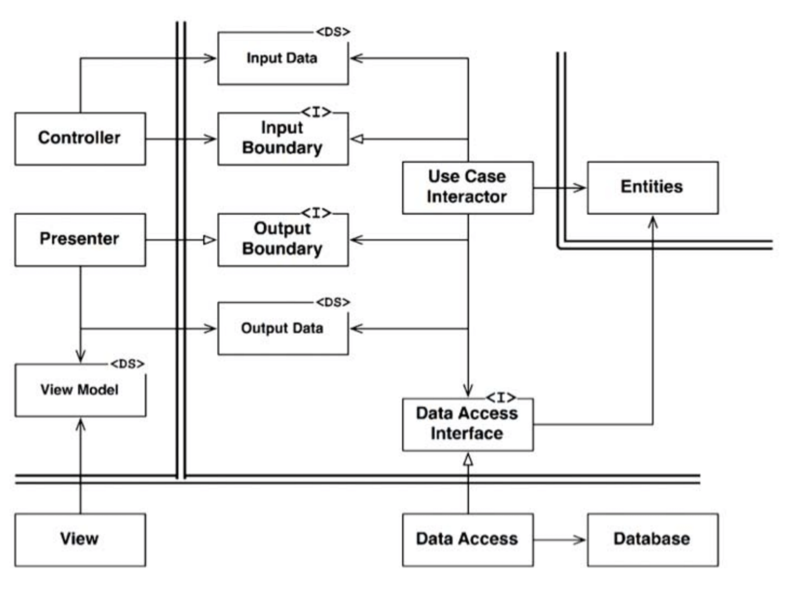

# :heavy_check_mark: The Clean Architecture

## :round_pushpin: Introduction
There are many architectures, but they all have one thing in common. They separate the concerns. They divide the software into layers. At least one for business rules and one for UIs.

They produce systems with the following characteristics:
- **Independent of frameworks:** They do not depend on frameworks.
- **Testable:** The business rules can be tested without any external element.
- **Independent of the UI:** The UI can be easily replaced without changing the rest of the system.
- **Independent of the database:** Your business rules are not bound to any database.
- **Independent of any external agency:** Your business rules do not know about anything about interfaces to the outside world.

The image below shows an attempt at integrating all archictures into a single actionable idea:

## :round_pushpin: The Dependency Rule

In the image, the outer circles are lower-level policies and the inner are higher-level. The further inwards you go, the higher the level is.

The inner circles are policies. The rule that makes this architecture work is the `Dependency Rule`.

>*Source code dependencies must point only inward, toward higher-level policies*.

The inner circle cannot know about the outer circle. The name of something in the outer circle must not be mentioned in the inner circle.

### Entities
The `Entities` layer encapsulate Critical Business Rules. It can be an object with methods, or it can be a set of data structures and functions.

No operational change to any particular app should affect the entity layer.

### Use Cases
The `Use Cases` layer contains *application-specific* business rules. It implements all use cases of the system. The use cases orchestrate flow of data to and from entities.

Changes in this layer should not affect entities. Changes in externalities should also not affect use cases. It is isolated from such concerns.

Changes in the operation of the app will affect the use cases, and therefore, the software in this layer.

### Interface Adapters
The `Interface Adapters` layer converts data from use cases and entities to data for external agencies (like databases or the web).

This layer contains the MVC architecture of the GUI. This is where the presenters, views, and controllers all belong. The models are just data structures passed from controllers to use caess and back from use cases to presenters and views.

It also converts data from use cases and entities to persistence frameworks.

This layer is just basically the bridge where internal/external are converted to/from each other.

### Frameworks and Drivers
The outermost layer consists of `Frameworks and Drivers` such as frameworks and tools such as database and web frameworks. You pretty much do not write code here. You can just glue the code to the next circle inwards (i.e. `import`).

This layer is where all the details go. Web is a detail. Database is a detail. We keep them outside to do no harm to the inside.

### Only Four Circles?
The circles are schematic. You may need more than those shown. There's no rules to this.

No matter what, the `DIP` always applies. Code dependencies always point inwards. The outermost is low-level, and the innermost is high-level.

### Crossing Boundaries
The lower right is how we cross the circle boundaries. The controllers and presenters communicate with the use cases. It begins with the controller, moves through the use case, and ends up executing in the presenter. The code deps also point towards the use cases.

We resolve this contradiction by using interfaces and flipping the dependencies. Suppose the use case wants to call presenter. This *cannot* be direct because it violates dependency principle because the inner circle mentions the outer circle. We have to use an interface in the inner circle, and we have presenter implement this.

We take advantage of dynamic polymorphism to create dependencies that oppose flow of control.

### Which Data Crosses The Boundaries
Simple data structures cross the boundaries. The important thing is that isolated, simple data structures are passed across the boundaries. We do not want the data structures to have any kind of dependency that violates the Dependency Rule.

Many database frameworks return convenient data format in response to a query. We can call this "row structure". We do not want to pass the row across the boundary.

When we pass data across the boundary, it is always in the form that is most convenient for the inner circle.

## :round_pushpin: A Typical Scenario

The image above is a typical scenario for a web-based Java system using a database.

The web server gets input data from user and gives it to `Controller` in the upper left. It packages that data into old Java object and passes through `InputBoundary` to `UseCaseInteractor`. The `UseCaseInteractor` interprets data and uses it to control the `Entities`. It also uses `DataAccessInterface` to bring data used by `Entities` into memory from `Database`.

When done, the `UseCaseInteractor` gathers data from `Entities` and constructs `OutputData` as another plain old Java object. The `OutputData` is passed through `OutputBoundary` interface to the `Presenter`.

The job of `Presenter` is to repackage the `OutputData` into viewable form as `ViewModel`, which is another Java object. `ViewModel` contains `Strings` and flags that the `View` uses to display data. The `OutputData` may contain `Date` objects, the `Presenter` will load `ViewModel` with `Strings` already formatted properly. The same is true for `Currency` objects. `Button` and `MenuItem` names are placed in `ViewModel`, as are flags that tell the `View` whether those `Buttons` and `MenuItems` should be gray.

This leaves `View` with almost nothing to do other than move data from `ViewModel` to `HTML` page.

All dependencies cross the boundary pointing inward, following the `Dependency Rule`.
