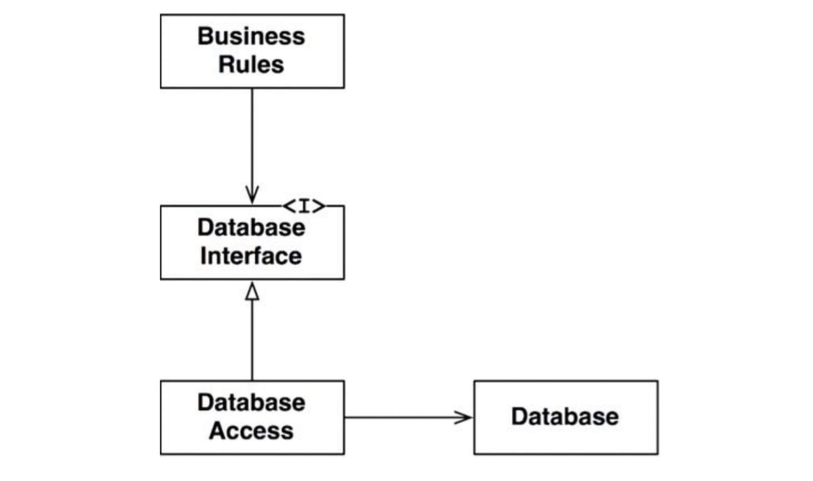
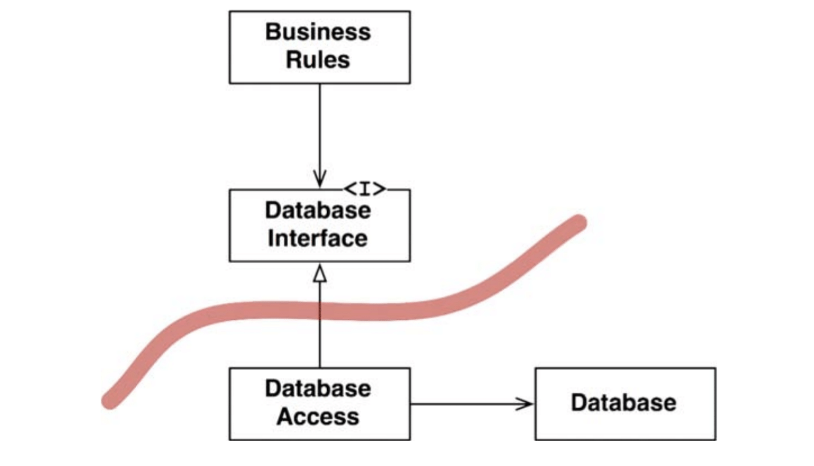
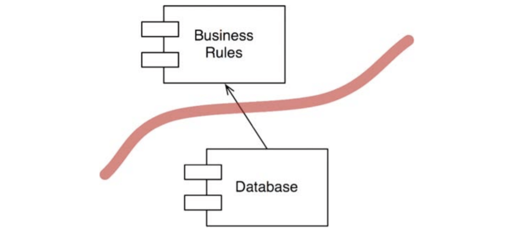
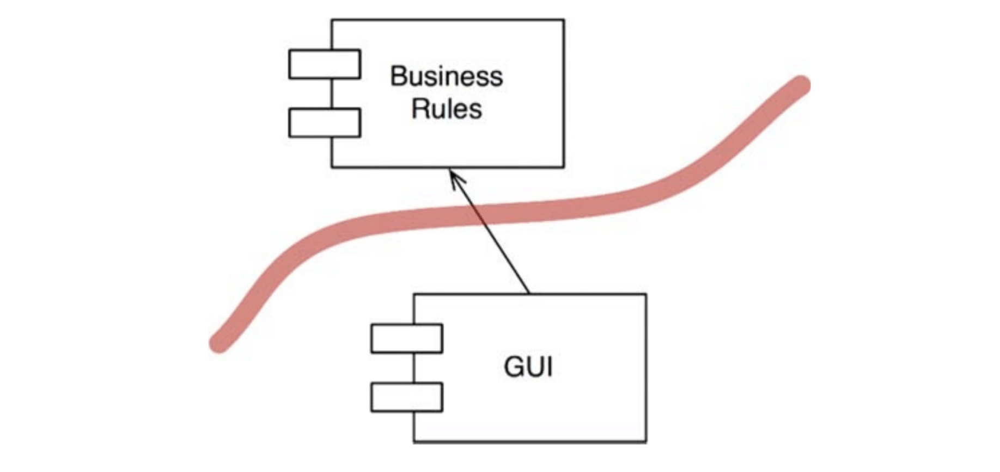
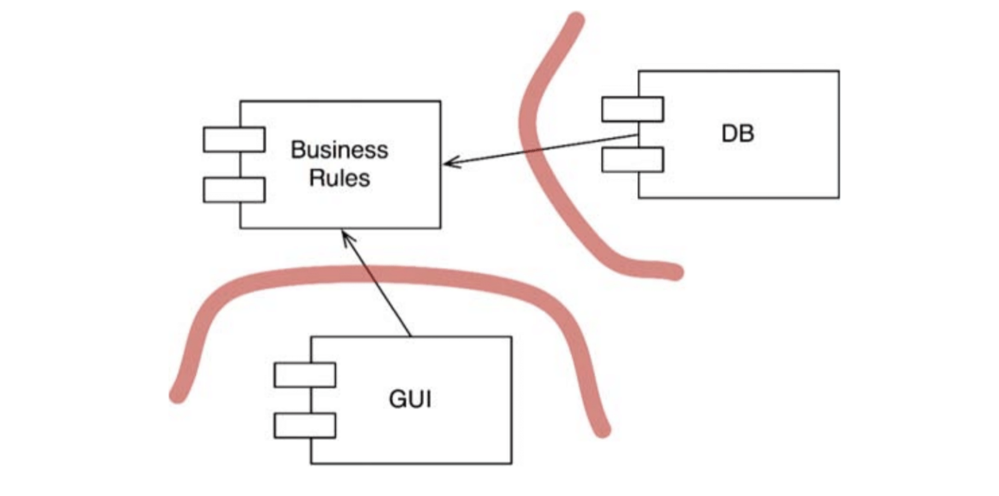
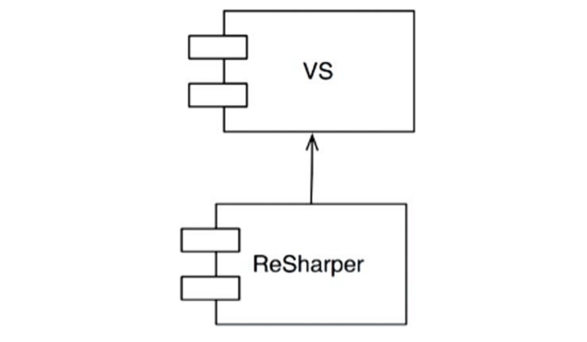

# :heavy_check_mark: Boundaries: Drawing Lines

## :round_pushpin: Introduction
Software architecture is the art of drawing lines. These lines represent boundaries between software elements. Elements on one side cannot know about what goes on with other elements on the other side.

An architect's job is to minimize human resources required to build and maintain projects.

There are premature decisions. These are decisions that have nothing to do with business requirements (use cases). These are decisions that include picking frameworks, databases, web servers, utility libraries, etc. A good system allows us to defer choosing these things until later without impacting the system.

## :round_pushpin: Failure
It is never a good idea to make a premature decision when building a system. It's the best idea to build a system that allows you to defer decisions about non-business rule functionality until later.

Your application/system should not depend on these decisions but allow you to make that decision later.

Otherwise, you will end up spending unnecessary amount of time to get a simple thing done, and you will *fail*.

## :round_pushpin: Which Lines Do You Draw, and When Do You Draw Them?
You draw lines between things that matter and things that do not.

The UI does not matter to the business rules, so there's a line between them. The business rules does not matter to the database, so draw another line. Same for the UI and database.

Some might disagree with the boundary between the database and the business rules. Some might say that the database is the embodiment of the business rules.

However, that idea is not true. The database is a tool that the business rules can use *indirectly*.

The business rules does not care about the schema, query language, or any other details about the database. It just needs to know the names of the functions to *save* and *fetch* data. This allows us to put the database behind an interface. See the image below.

The `BusinessRules` uses the `DatabaseInterface` to load and save data. The `DatabaseAccess` implements the `DatabaseInterface` and uses the `Database`. In a real app, there would be many of these classes and interfaces. They would follow the same pattern.

Where is the boundary line? It is drawn across the inheritance relationship below the `DatabaseInterface`.

Notice that `DatabaseAccess` has two outgoing arrows. None of those classes know about `DatabaseAccess`.

Let's look at the component that contains many business rules and the component that contains the database and its access classes.

Here, the `BusinessRules` does not know about the `Database`. This means `DatabaseInterface` lives in the `BusinessRules` component. The `DatabaseAccess` classes live in the `Database` component.

It shows that `Database` does not matter to the `BusinessRules`. The `Database` cannot exist without `BusinessRules`.

This shows that `BusinessRules` can use any kind of database. The database can be implemented with Oracle, MySQL, or Couch, or Datomic, or even flat files.

This means you can defer the decision to choose a database until later.

## :round_pushpin: What About Input and Output?
Devs and customers make the mistake of thinking the GUI/UI is the system because it's the first thing they see. So, they believe changes to be immediate. This is *not* true because *the IO is irrelevant*.

Imagine playing a game on a computer. You use a keyboard, screen, mouse, etc. The game is more complicated under the hood, and it drives the functions of the IO devices. However, the game *does not need* the IO devices to function because it can still run even without these.

The image below is the boundary between the `GUI` and the `BusinessRules`. The `GUI` knows the `BusinessRules`, but not the other way around.

The `GUI` can be replaced by any other interface.

## :round_pushpin: Plugin Architecture
This creates a pattern. This is the same pattern as systems that allow third-party plugins. See the plugin form below.

We can plugin many different kinds of user interfaces. This is also true of databases.

## :round_pushpin: The Plugin Argument
Take a look at the relationship between `ReSharper` and `Visual Studio`. The teams that develop these are completely different. Which team can damage the other? Which team is immune to the other?

The dependency structure tells us below.

`ReSharper` depends on Visual Studio. `ReSharper` *does not* affect Visual Studio at all. This is what we desire in our systems.

We want certain modules in our systems to be immune to others. We do not want fragility in our system.

This is simply the `Single Responsibility Principle (SRP)`. It tells us where to draw the lines for the boundaries.
