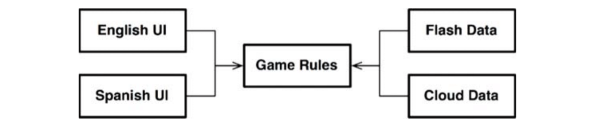
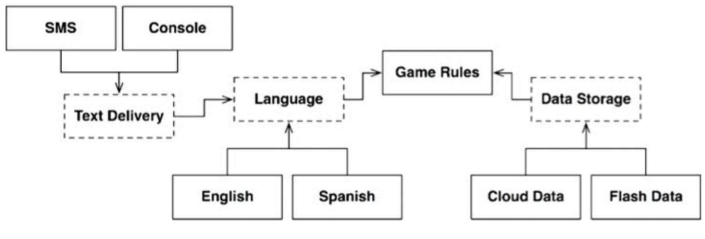
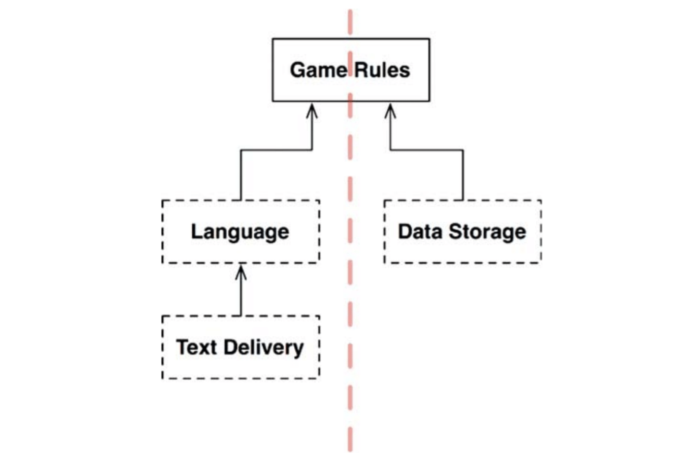
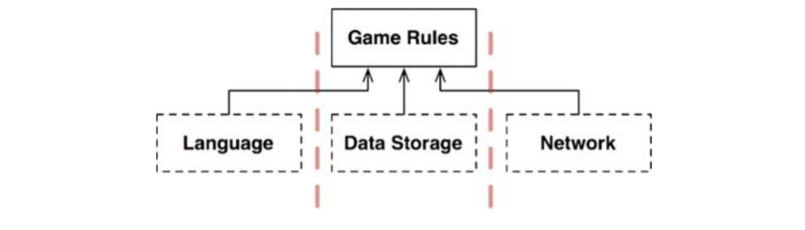
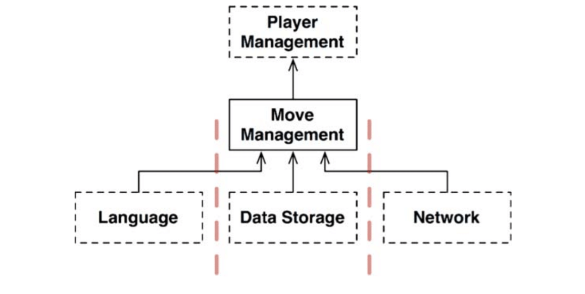
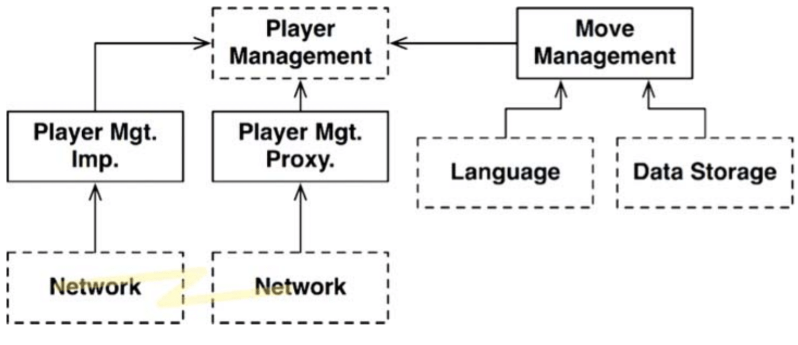

# :heavy_check_mark: Layers and Boundaries

## :round_pushpin: Introduction
There are more than three components in systems, not just UI, business rules, and the database.

Let's consider a simple game.

## :round_pushpin: Hunt The Wumpus
The game is Hunt the Wumpus. This is a text-based game that uses simple commands like GO EAST and SHOOT WEST.

The players enter commands, and the computer responds with what the player sees, smells, hears, and experiences. The player hunts for a Wumpus in a system of caverns. They must avoid traps, pits and other dangers.

Assume we keep the text-based UI. Decouple it from the game rules so our version can use different languages in different markets. The game rules will communicate with the UI component using a language-independent API. The UI translates the API into the appropriate human language.

If dependencies are set propery, any UIs can reuse the same game rules. The game rules *do not* know about the UI. See the image below. Notice the UI depends on the game rules. Not vice versa.

Let's also say the state of the game is also stored in some persistent store. We don't want the game rules to know the details. So, we create an API that the game rules can use to communicate with the data storage component.

The game rules do not know about data storage. It looks like the image below.

## :round_pushpin: Clean Architecture?
We can apply clean architecture approach in this context. Did we find all the boundaries?

Language is not the only axis of change for the UI. We also might want to vary how we communicate the text. That means there is a potential architectural boundary defined by this axis of change.

Should we make an API that crosses that boundary and isolates the language from the communications mechanism? See the image below.

The dashed outline means abstract components that define an API implemented by the components above and below them. The `Language` API is implemented by `English` and `Spanish`.

The `GameRules` communicates with `Language` through an API that `GameRules` defines and `Language` implements. `Language` communicates with `TextDelivery` using an API that `Language` defines but `TextDelivery` implements.

The API is designed and owned by the user, rather than the implementer. If we look inside `GameRules`, we would find polymorphic `Boundary` interfaces used by the code inside `GameRules` and implemented by code inside `Languages`. Also, vice versa. Same thing for `Languages` and `TextDelivery`.

In each case, the API defined by those `Boundary` interfaces is owned by the upstream component.

The variations are provided by polymorphic interfaces defined in the abstract API component, and implemented by the concrete components that serve them. There is a polymorphic interface defined in `Language` to be implemented by `English` and `Spanish`.

We simplify the diagram by getting rid of variations. Just focus on API components. See the image below.

Notice all arrows point *up*. So, `GameRules` is the component with the highest-level policies.

Information flows from `TextDelivery` to `Language` to `GameRules` to write to `DataStorage`.

`GameRules` then sends output back down to `Language`. Then it delivers that language through `TextDelivery`.

There are two streams. The left stream communicates with the user. The right stream communicates with the storage. They both meet at the top.

## :round_pushpin: Crossing The Streams
There can be multiple streams. Imagine playing multiplayer. See the three streams below. The third is the new `Network` component. They are all controlled by `GameRules`.

It is now more complex, as the component structure might split into many streams.

## :round_pushpin: Splitting The Streams
You may think all streams meet at the top. But no!

Look at the `GameRules` component for Hunt the Wumpus. The game rules deal with the mechanics of the map.

There is another set of policies at an even higher-level. It knows the player health, and the cost of an event. The lower-level mechanics would tell the higher-level policy some actions. The higher-level component then acts on these actions and manages the state of the player. See the image below.

Do we need an API that separates `MoveManagement` and `PlayerManagement`? Let's add micro-services.

Say that the game is a huge multiplayer game. The `MoveManagement` is handled locally on all player's computer. The `PlayerManagement` is handled by a server. `PlayerManagement` provides a micro-service API to all `MoveManagement` components.

The `Network` is a bit more complicated. An architectural boundary exists between `MoveManagement` and `PlayerManagement`.
