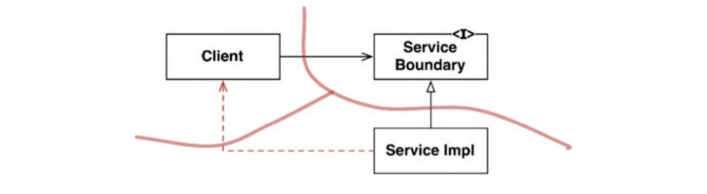
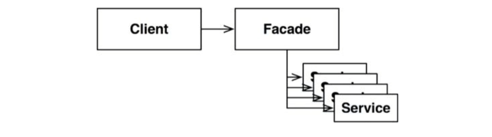

# :heavy_check_mark: Partial Boundaries

## :round_pushpin: Introduction
Complete architectural boundaries are expensive. They require reciprocal polymorphic `Boundary` interfaces, `Input` and `Output` data structures, and all the dependency management to isolate two sides into independently compatible and deployable components. This takes a lot of work.

The architect might deem the cost too high, but still set in place something that allows us to do that in case it is needed.

This kind of design is frowned upon by many in Agile as a violation `YAGNI`: You Aren't Going to Need It. But architects think: "But we might." In this case, they may implement a *partial boundary*.

## :round_pushpin: Skip The Last Step
One way to do this is to create independently compilable and deployable components and keep them under one component. Everything is there, but we compile and deploy as a single component.

This kind of boundary still requires the same code and design work of a full boundary. However, it does not require maintaining multiple components.

## :round_pushpin: One-Dimensional Boundaries
A simpler structure that serves to hold the place for later extension to a full-fledged boundary is shown in the image below.

It is the traditional `Strategy` pattern. A `ServiceBoundary` interface is used by `Client` and implemented by `ServiceImpl` class.

So, this sets the stage for a future architectural boundary. The inversion is in place. Also, it is easy to mess with the separation as shown by the dotted arrow in the diagram. It is up to the discretion of the devs and architects to adhere.

## :round_pushpin: Facades
An even simpler boundary is the `Facade` pattern. It is shown below.

The dependency inversion is sacrificed. The boundary is just the `Facade` class. It lists all services as methods and deploys the service calls to classes that the client is not supposed to access.

The `Client` now has a transitive dependency on all the service classes.
