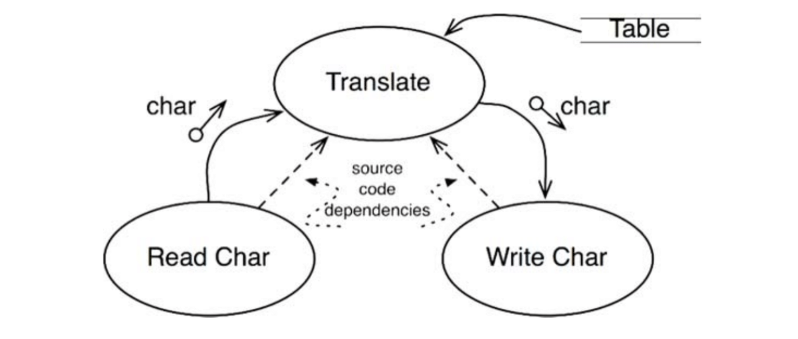
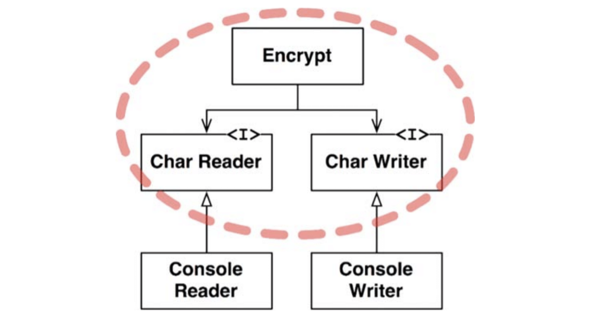

# :heavy_check_mark: Policy and Level

## :round_pushpin: Introduction
A program is just a detailed description of the policy that transforms input into output.

Policy can be broken down into many different policies.

We have to carefully separate these policies from one another. This should be based on whether they change for the same/different reasons.

We can then regroup these components into a directed acyclic graph. The nodes are the components and the edges are the dependencies between those components.

Low-level components should depend on high-level components.

## :round_pushpin: Level
A definition of "level" is the distance to the inputs and outputs of a system. The farther they are, the higher its level. The closer they are, the lower the level.



In the image, something reads the characters from an input device, translates the characters using a table, and writes the translated characters to an output device. Data flows are shown in solid arrows. The dashed, straight arrow shows dependencies.

`Translate` is the highest-level component because it is farthest from input/output.

Note the data flow and deps do not point in the same direction. We want code deps to be decoupled from data flow and *coupled to level*.

The code below is the wrong way:
```js
function encrypt() {
  while (true)
    writeChar(translate(readChar()))
}
```
Notice that the high-level `encrypt` function depends on the lower-level `readChar` and `writeChar` functions.

A better architecture is below.



The dashed border is surrounding the `Encrypt` class and `CharReader` and `CharWriter` interface. All deps crossing this boundary point inside the boundary. This red unit is the highest-level element in the system.

The `ConsoleReader` and `ConsoleWriter` are low-level because they are close to the inputs and outputs.

When changes are made to the input/output policies, they will not affect the encryption policy.

We separate the low-level and high-level policy with `SRP` and `CCP`.

Another way to look at it is that the lower-level components should be "plugins" for higher-level components.
