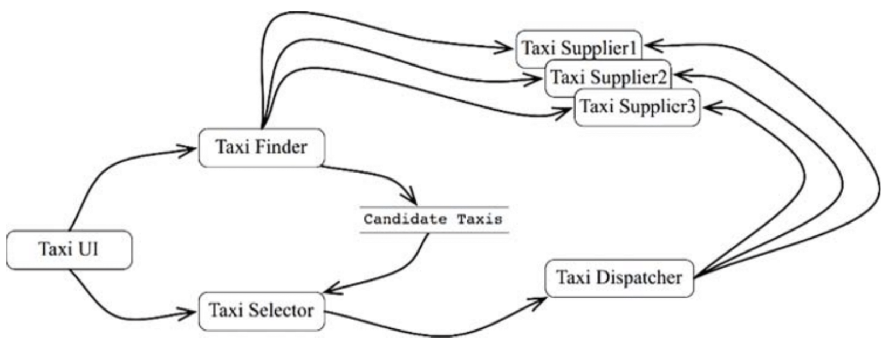
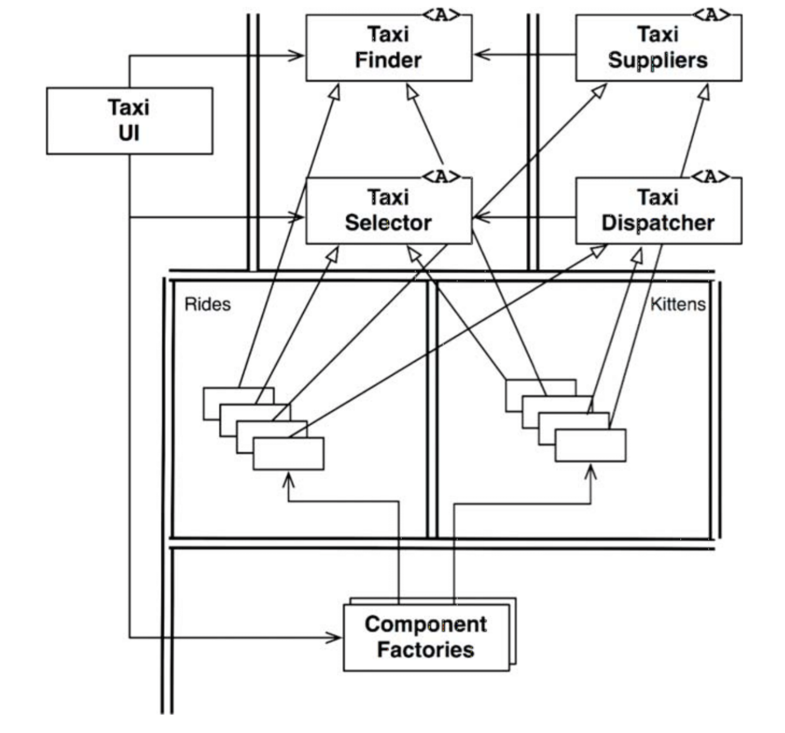
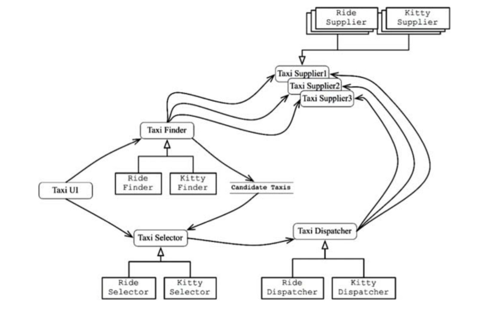
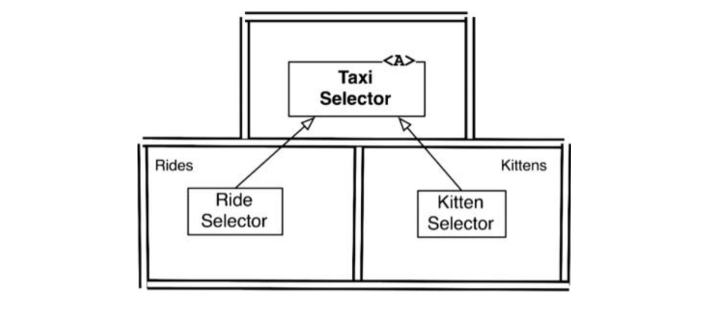

# :heavy_check_mark: Services: Great and Small

## :round_pushpin: Introduction
Service-oriented architecture and micro-service architecture are popular. The reasons are because:
- Services seem to be strongly decoupled from one another. This is only partially true.
- Services appear to support independence of development and deployment. This is partially true.

## :round_pushpin: Service Architecture?
There's a notion that using services is an architecture. This is untrue. The architecture is defined by how well the boundaries between high-level policy and low-level detail are placed. Services that just separate app behaviors are just expensive function calls.

We are not saying that services *should* be architecturally significant. Services do not define an architecture.

Services are just function calls across process and/or platform boundaries. Some of those are architecturally significant and some aren't.

## :round_pushpin: Service Benefits?
We are going to challenge the current popular orthodoxy of service architecture.

### The Decoupling Fallacy
One supposed benefit is that breaking a system into services decouples all services from each other. This is because each service runs in a different process or processor. So, those services do not have access to each other's variables.

This is partially true. However, they can still share resources within a processor or network. They are strongly coupled to the data they share.

Imagine that a new field is added to the data record passed between services. Every service that uses that field must change. Those services are strongly coupled to the data record, and indirectly coupled to each other.

Service interfaces are the same as function interfaces.

### The Fallacy of Independent Development and Deployment
Another supposed benefit is that services can be owned and dedicated to a team. This is presumed to be *scalable*. It is believed that large enterprise systems can be created from dozens, hundreds, or even thousands of independently developable and deployable services.

There is some truth. First, history has shown that large enterprise systems can scale well from monoliths and component-based systems and service-based systems. So, services are *not* the only way to build scalable systems.

The decoupling fallacy means that services cannot always be independently developed, deployed, and operated.

## :round_pushpin: The Kitty Problem
Let's see an example of these two fallacies. Look at our taxi aggregator system.

The system knows about taxi providers and allows users to order rides. We chose to build it using micro-services to help it be scalable. We divided our staff into many dev teams. They were each responsible for developing, maintaining, and operating those small services. See the diagram below to see how the architects arranged the services.

The `TaxiUI` deals with customers who use mobile devices to order taxis. The `TaxiFinder` service looks at inventories of various `TaxiSuppliers` and chooses taxis for the user. It deposits this into a data record for that user. The `TaxiSelector` takes the user's choices and chooses an appropriate taxi candidate. It then hands this taxi to the `TaxiDispatcher` service which orders the taxi.

Say that one day, the marketing department needs a kitten delivery service. The company will set up collection points across the city. One taxi supplier agreed to participate. Some drivers may be allergic, so these drivers should *never* be selected. Some customers may have allergies, so taxis that had been used to deliver kittens must not have picked up a kitten 3 days prior.

How many of these services will need change? *All of them*. The services are all coupled, and they cannot be independently developed, deployed, and maintained.

This is the problem with cross-cutting concerns. Every system deals with this problem, whether service-oriented or not. Functional decompositions are very vulnerable to new features that cut across all those functional behaviors.

## :round_pushpin: Objects To The Rescue
How do we solve this problem in a component-based architecture? We consider `SOLID` principles careefully. We create classes that are polymorphically extended to handle new features. See the image below.

The classes here correspond to the micro-services in the previous section. Note the boundaries. The dependencies also follow the `Dependency Rule`.

Most logic of the original services is preserved in the base classes of the object model. The portion of the logic specific to *rides* is extracted into the `Rides` component. New feature for kittens is placed into a `Kittens` component. The two components override the abstract base classes in the original components using a pattern like `Template Method or Strategy`.

The two components follow the Dependency Rule. The classes that implement those features are created by factories under the control of the UI.

Clearly, when the Kitty feature is implemented, the `TaxiUI` must change. Here, the Kitty feature is decoupled and independently developable and deployable.

## :round_pushpin: Component-Based Services
Can we do that for services? Yes. Services do not need to be monoliths. They can be designed using the `SOLID` principles, and be given a component structure. New components can be added without disturbing existing components.

Think of a service in Java as a set of abstract classes in one or more jar files. Think of each new feature/feature extension as another jar file that contains classes that extend the abstract classes in the first jar files.

Deploying a new feature becomes a matter of *adding* new jar files to the load paths of those services. This conforms to the `Open-Closed Principle (OCP)`. See the image below.

The services exist as before. Each has its own internal component design, allowing new features to be added as new derivative classes. Those derivative classes live within their own components.

## :round_pushpin: Cross-Cutting Concerns
Architectural boundaries do not fall *between* services. Those boundaries run *through* services, dividing them into components.

To deal with cross-cutting concerns that all systems face, services must be designed with internal component architectures that follow the `Dependency Rule`. This is shown in the image below.

