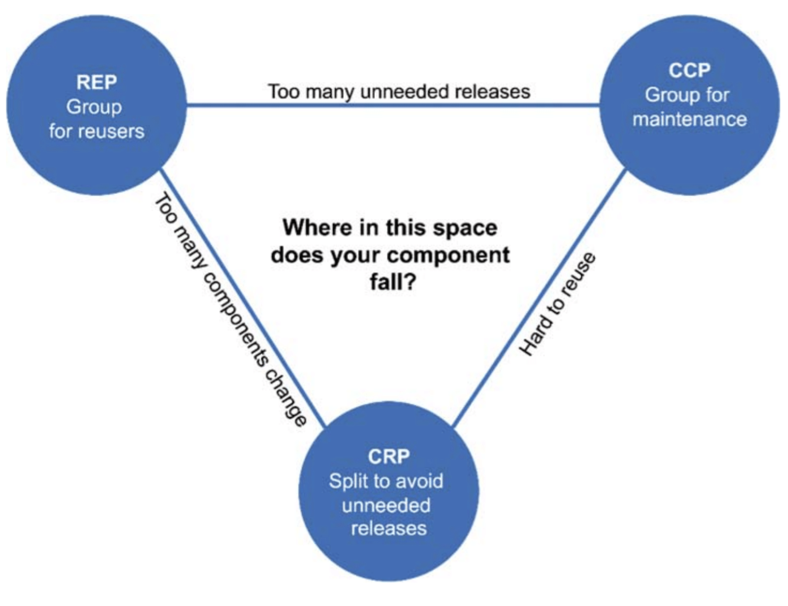

# :heavy_check_mark: Component Cohesion

## :round_pushpin: Introduction
Which classes belong in which component? This decision depends on the context. There are three principles of component cohesion:
1. **REP:** The Reuse/Release Equivalence Principle
2. **CCP:** The Common Closure Principle
3. **CRP:** The Common Reuse Principle

## :round_pushpin: The Reuse/Release Equivalence Principle
>*The granule of reuse is the granule of release*.

In this day, there are a lot of module management tools like `Maven`, `Leiningen`, and `RVM`. This is because a lot of reusable components and component libraries were created. We are living in an age of software reuse.

The REP means people who want to reuse software components cannot, and will not, do so unless those components are tracked through a release process and have release numbers.

This is because devs need to know when changes are coming and what changes those new releases will bring.

The dev should have the power to use the new release or the old release. So, the release process must make appropriate notifications and release documentation so that users can make decisions.

So, the classes and modules that are formed into a component must belong to a cohesive group. There must be a common theme that all those modules share. It can't just be random modules and classes.

They should also be *releasable* together.

It is easy to detect **violations** of REP.

## :round_pushpin: The Common Closure Principle

>*Gather into components those classes that change for the same reasons and at the same times. Separate into different components those classes that change at different times and for different reasons.*

This is the SRP restated for components.

For most apps, maintainability is more important than reusability. If code in the app needs to change, it's better to change them all in one place. If changes need to be spread out/scattered, that's not good.

If two classes are tightly bound (i.e. change for the same reason), it is much easier to revalidate, redeploy, and release together to minimize workload.

This principle is closely associated with OCP. Extend more than we should modify.

Gather together components that are closed to the same types of change.

### Similarity With SRP
CCP is the component form of SRP. SRP tells us to separate functions into different classes if they change for different reasons. The CCP tells us to separate classes into different components if they change for different reasons.

Here's a summary:

>*Gather those things that change at the same times and for the same reasons. Separate those things that change at different times or for different reasons*.

## :round_pushpin: The Common Reuse Principle
>*Don't force users of a component to depend on things they don't need*.

The CRP states that classes and modules that are reused together belong in the same component. We would expect to see classes with a lot of dependencies.

The CRP tells us also what *not* to put in a component. When one component uses another, a dependency is created no matter how small or big the usage is.

Due to this, any small irrelevant change the *used* component goes through that the *using* component does not care about will still cause the *using* component to redeploy and whatnot.

Thus, when we depend on a component, we should be depending on **all** the classes. We should not depend on some and not the others. This causes unnecessary redeployments.

The CRP tells us what classes *shouldn't* be in a component. Classes that are *not* tightly coupled *shouldn't* be in the same component.

### Relation To ISP
ISP tells us not to depend on classes whose methods we don't use. The CRP tells us not to depend on components whose classes we don't use. Better put:

>*Don't depend on things you don't need*.

## :round_pushpin: The Tension Diagram For Component Cohesion

The `REP` and `CCP` makes components larger. The `CRP` makes components smaller. The edges of the tension diagram above tell us the cost of abandoning the principle on the opposite vertex.

A good architect finds a position that meets the *current* concerns of the dev team, but is also aware that concerns change over time.

Projects usually start on the right-side of the triangle, where the only sacrifice is reuse. As it matures, it tends towards the left.
