# :heavy_check_mark: Component Coupling

## :round_pushpin: Introduction
The next principles will deal with the relationships between components.

## :round_pushpin: The Acyclic Dependencies Principle

>*Allow no cycles in the component dependency graph*.

Has there every been a time you worked on something, gone home, came back and found out that your code no longer worked? This is because someone stayed later than you did and worked on something *you* depend on. This is "the morning after syndrome".

This happens in large teams that work on the same code. It might last weeks where a team can't go with a stable version of the project. People will keep changing the code to make it work.

There are two solutions to this problem. The first is **the weekly build**, and the second is the **Acyclic Dependencies Principle (ADP)**.

### The Weekly Build
In this approach, developers work on their own copies of the code privately for the first four days. On Friday, they get together and integrate all of their work collectively, and they build the system.

This is a good approach because it gives devs quiet time/heads down time. However, the integration penalty they pay on Friday is *huge*.

This is great until the project gets huge. Integration day slowly creeps into Saturday then into the middle of the week. The efficiency of the team start to slowly decrease.

Then, this changes to a biweekly build. However, the integration time *still* continues to grow over time.

Lengthening build schedule increases project risk. Integration and testing is much harder, and feedback is harder to receive.

### Eliminating Dependency Cycles
The solution is to divide the dev environment into releasable components. These components become units of work that developers work on. When they get a component working, they release it for other devs to use. They provide it a release number, and they keep working on their own private component. Everyone else uses the released version.

Other teams can decide whether to use new releases or not. If they do not, they can just continue to use the old release. Once they are ready, they can use the new release.

So, integration happens in small increments. No team is at the mercy of the changes that another team places in the components. There is no point in time where all devs need to come together to integrate everything they are working on.

However, you still **must** manage the dependency structure of the components. *There can be no cycles*. See the image below.

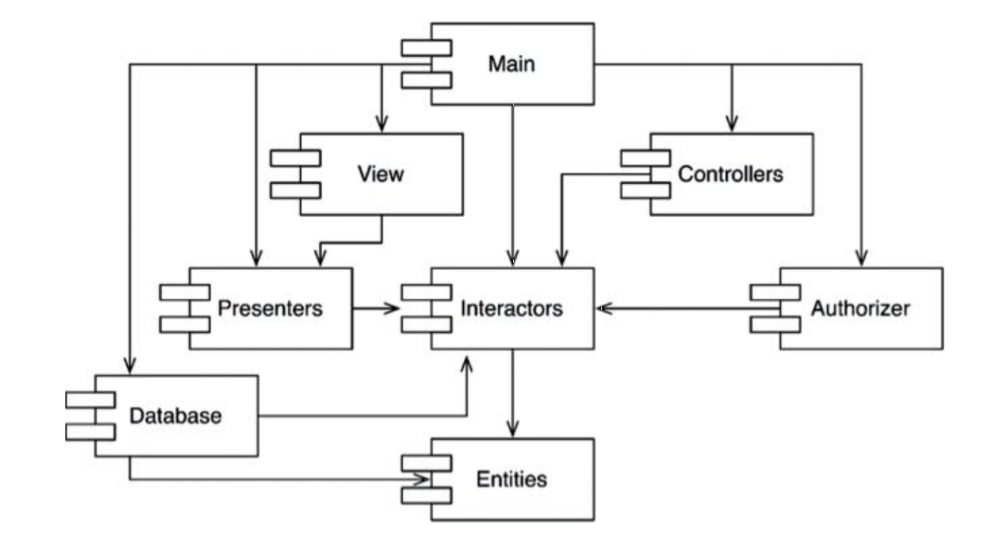

The image above shows some components assembled in an application. Notice that this is a *directed graph*. The components are *nodes*. The relationships are *directed edges*.

No matter where you start, it is impossible to end up back at the same component. This has *no* cycles. It is a **directed acyclic graph (DAG)**.

Consider what happens when the team working on `Presenters` component makes changes. It is easy to find out *who* gets affected. If we follow the arrows backwards, we find out that `View` and `Main` gets affected. They can decide *when* to integrate the new release of `Presenters`.

Also notice that when `Main` changes, *no one* knows about it. The impact of changing `Main` is small.

If the devs of `Presenters` want to run tests, all they have to do is build versions of `Presenters` with versions of `Interactors` and `Entities`. None of the other components need to be involved in this.

When the whole system needs to be released, the process happens from the *bottom-up*. The `Entities` gets compiled, tested, and released. Then comes `Database` and `Interactors`. Then `Presenters`, `View`, `Controllers`, and then `Authorizer`. `Main` goes last.

### The Effect of a Cycle in the Component Dependency Graph
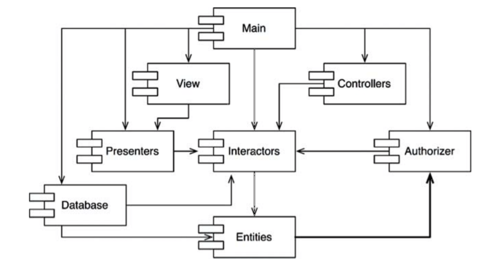

Suppose there is a new requirement to change a class in the `Entities` component. It has to use a class in `Authorizer` component. Let's say the `User` class in `Entities` uses the `Permissions` class in `Authorizer` component. This creates the cycle shown above.

This creates a problem. The devs working on `Database` must now rely on `Entities`, `Authorizer`, *and* `Interactors`. This makes `Database` much more difficult to release, making it a nightmare for everyone to be on the same release.

But what if we also want to *test* `Database`? This means we must build and integrate `Authorizer` and `Interactors` as well. See this coupling nightmare?

### Breaking The Cycle
We can always break the cycle and make it back into a DAG. There are two mechanisms:

1. Apply the `Dependency Inversion Principle (DIP)`. The image below shows a great example of how to deal with it. We need an interface that has the methods that the `User` needs. We put that interface into `Entities` and inherit it into `Authorizer`. This inverts the dependency between `Entities` and `Authorizer`, breaking the cycle.
    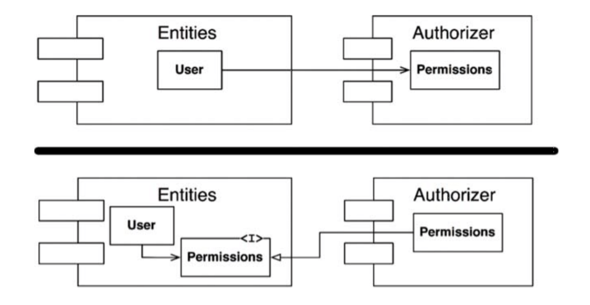
2. We can also create a new component that both the `Authorizer` and `Entities` depend on. Move the class(es) that they both depend on into that new component. See the image below.
    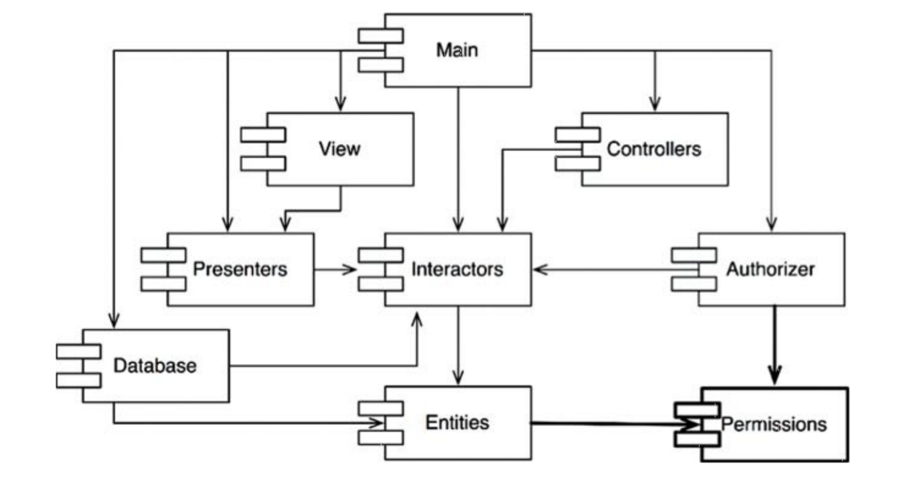

### The "Jitters"
Using solution 2 above indicates that the component structure is volatile to changing requirements.

As the app grows, the component dependency structure jitters and grows. We have to monitor for cycles and decide the appropriate steps to solve cycles in components.

## :round_pushpin: Top-Down Design
There is one inescapable conclusion: The component structure cannot be designed from the top down. It evolves as the system grows.

Component dependency diagrams tell us about the *buildability* and *maintainability* of the app. It does *not* tell us about the functionality of the app. This is why they are not designed at the beginning of a project. In the beginning, there is not need for a dependency map because there is very little of it. It is only when the app/project gets big that we need one.

One concern is the isolation of volatility. We do not want components that change frequently and for capricious reasons to affect components that are ought to be stable. As an example, we do not want changes to the GUI to have an impact on the business rules. Therefore, the component graph is built by architects to protect stable high-value components from volatile components.

The component dependency structure grows and evolves with the logical design of the system.

## :round_pushpin: The Stable Dependencies Principle

>*Depend in the direction of stability*.

Designs are not expected to be completely static. Some volatility is needed. We have to conform to the `Common Closure Principle (CCP)`. We create components that are sensitive to certain changes and immune to others. Some components are *designed* to be volatile. We *expect* them to change.

Any component that is volatile *should not* be depended on by a component that is difficult to change.

Imagine you created a module that is supposed to be easy to change. Then, someone else creates a separate module that depends on *your* module. Now, you can't make easy changes on your module because the other dev might depend on your changes to *not* change.

By conforming to the `Stable Dependencies Principle (SDP)`, we ensure that modules that are intended to be easy to change are not depended on by modules that are harder to change.

### Stability
What does it mean to be "stable"?

One way to make a component difficult to change is to make it be depended on by a lot of other components. A component with a lot of incoming dependencies is very stable because it requires a lot of work to reconcile changes with all dependent components.

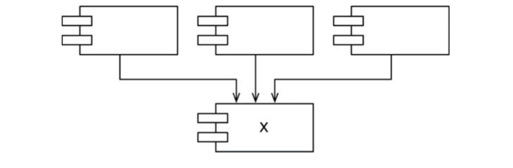

The image above shows the stable component marked with an `X`. Three components rely on `X`, so it has three reasons *not* to change. So, `X` is responsible for those three components, and `X` does not rely on anything. `X` is **independent**.

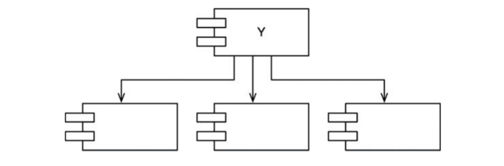

We see that `Y` is very unstable. Nothing depends on `Y`, so `Y` is irresponsible. `Y` depends on three other components, so `Y` is **dependent**.

### Stability Metrics
How can we measure the stability of a component?

One way is to count the ingoing and outgoing dependencies of that component. This allows us to calculate the *positional* stability of that component.
- **Fan-in:** Incoming dependencies. This identifies the number of classes outside this component that depend on classes within this component.
- **Fan-out:** Outoing dependencies. This identifies the number of classes inside this component that depend on classes outside the component.
- **I:** Instability. Here, `I = Fan-out / (Fan-in + Fan-out)`. This has the range `[0,1]`. `I = 0` indicates a maximally stable component. `I = 1` indicates a maximally unstable component.

Consider the image below.

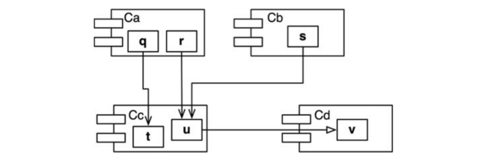

Calculate the stability of component `Cc`. There are three classes outside this component that depend on classes in `Cc`. Thus, `Fan-in = 3`. There is one class outside `Cc` that classes in `Cc` depend on. Thus, `Fan-out = 1`. Therefore, `I = 1/4`.

These can be counted in languages by looking `#include` or `import` statements, depending on the language.

An unstable component (`I = 1`) means that no components depend on this component. This component depends on other components. This gives the component no reason not to change. The components that the unstable component depends on gives it reasons to change.

A stable component (`I = 0`) means a lot of components depend on this stable component. It is very hard to change a stable component. It has no dependencies that force it to change.

The SDP says that the *I* metric of a component should be larger than the *I* metric of the components that it depends on. So, *I* metrics should *decrease* in the direction of dependency.

### Not All Components Should Be Stable
We don't want *all* components to be stable. If so, nothing would be able to change. We want some to be stable and some to be unstable. See the image below for an ideal configuration with three components.

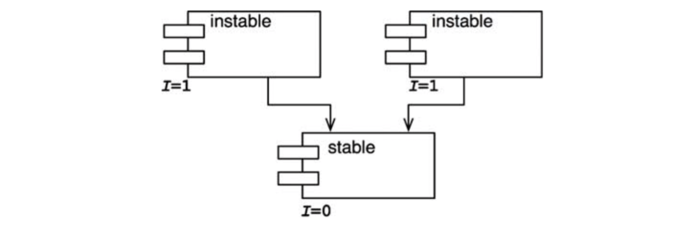

The changeable components are on top. They rely on components on the bottom, which are stable. Putting the unstable components on top is a good convention because arrows will point down. Any arrows pointing *up* will show a violation of the SDP. See the image below.

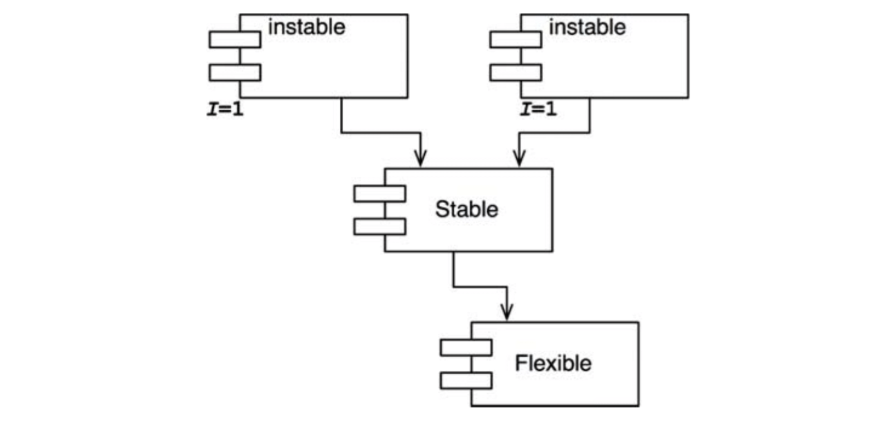

Here, `Flexible` is a component that is easy to change. Some dev in `Stable` hung a dependency on `Flexible`. This violates the SDP because the *I* metric no longer decreases with the direction of dependency. This means `Flexible` is no longer easy to change. A change in `Flexible` forces us to deal with `Stable` and all of its dependents.

To fix this, we need to break the dependence of `Stable` on `Flexible`. Assume there is a class `C` in `Flexible` that a class `U` in `Stable` needs.

Fix this by using the DIP. See the image below.

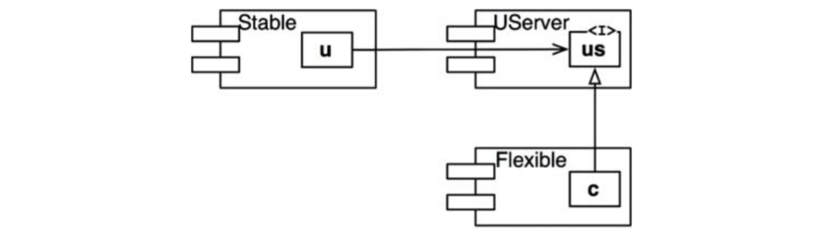

We create an interface called `US` and put it in a component `UServer`. This interface declares all methods that `U` needs to use. We make `C` implement this interface. This breaks the dependency of `Stable` on `Flexible`. It forces both to rely on `UServer`. `UServer` becomes very stable (`I = 0`). `Flexible` remains unstable (`I = 1`). All dependencies not flow in the direction of *decreasing I*.

### Abstract Components
It may seem weird that we created a component `UServer` with *no executable code*. It only has an interface. This is a very common practice. These abstract components are very stable and are good targets for less stable components to depend on.

In dynamically-typed languages, these abstract components don't exist at all. Dependency structures in these languages are much simpler because dependency inversion *does not* require either the declaration or the inheritance of interfaces.

## :round_pushpin: The Stable Abstractions Principle

>*A component should be as abstract as it is stable*.

### Where Do We Put The High-Level Policy?
The software that encapsulates the high-level policies of the system should be placed into stable components (`I = 0`). Unstable components (`I = 1`) should contain software that is volatile (software we want to be able to quickly change).

However, if we place the high-level policies inside stable components, this makes the policies difficult to change. This leads to an inflexible architecture. How can a component that is maximally stable be flexible enough to withstand change?

The answer is in OCP, where it is desired to create classes that are extendable. What kind of classes conform to this? `Abstract classses`.

### Introducing The Stable Abstractions Principle
The `Stable Abstractions Principle (SAP)` sets up the relationship between stability and abstractness.

It says a stable component should also be abstract so that its stability does not prevent it from being extended. It also says that an unstable component should be concrete since its instability allows the concrete code to be easily changed.

So, if a component is stable, it should consist of interfaces and abstract classes so that it can be extended. Stable components that are extensible are flexible and do not overly constrain the architecture.

The `SAP` and `SDP` combined amount to the `DIP` for components.

The `SDP` says dependencies run in direction of stability. The `SAP` says stability implies abstraction. So, **dependencies run in the direction of abstraction**.

The `DIP` deals with classes and there is no gray area for classes. It is either abstract or it is not. The combination of `SDP` and `SAP` deals with components. It allows a component to be partially abstract and partially stable.

### Measuring Abstractions
The `A` metric is a measure of abstractness of a component. Its value is the ratio of interfaces and abstract classes in a component to the total number of classes in the component.
- `Nc`: The number of classes in the component.
- `Na`: The number of abstract classes and interfaces in the component.
- `A`: Abstractness. `A = Na / Nc`.

The `A` metric ranges from `0` to `1`. `0` implies that the component has *no* abstract classes at all. `1` implies that the component contains nothing but abstract classes.

### The Main Sequence
We can now define the relationship between stability (*I*) and abstractness (*A*). See the image below.

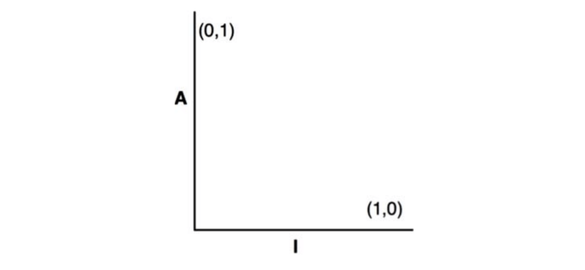

There are two "good" kinds of components on this graph.
- The upper-left shows a maximally stable and abstract component `(0,1)`.
- The bottom-right shows a maximally unstable and concrete component `(1,0)`.

Not all components fall in these two categories. This is because components have varying degrees of abstraction and stability. It is common for one abstract class to derive from another abstract class. This creates a dependency. Though it is maximally abstract, it is not maximally stable anymore.

We cannot enforce components to be in the two categories. We assume there is a locus of points on the `A/I` graph that shows reasonable areas where components can be. We can infer this by finding the areas where we *know* the components **should not be**. We also know that the components must fall in the square depicted below, not outside of it.

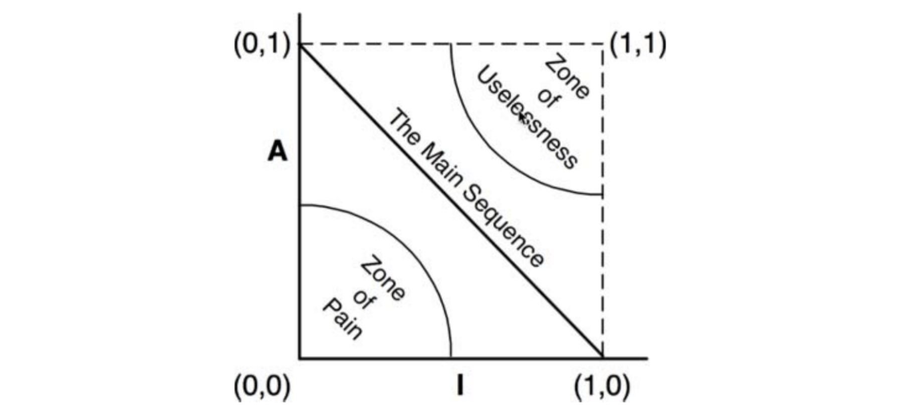

### The Zone of Pain
Consider a component in the area of `(0,0)`.

This is a highly stable and concrete component. This component is not desirable because it is rigid. It cannot be extended because it is *not* abstract. It is difficult to change because it is stable. We do not normally see well-designed components here. This is called the `Zone of Pain`.

However, some software entities *do* fall in this category. An example is a database schema. They are notoriously volatile, extremely concrete, and highly depended on. The interface between `OO` applications and databases is difficult to manage. So, schema updates are painful.

Another example is a utility library. A library like this has an `I` of 1, but it may be nonvolatile. Consider the `String` class of Java. The classes within it are concrete, but it is so commonly used that any changes would wreak havoc. Therefore, `String` is nonvolatile.

It is only volatile components that are problematic in this zone. The more volatile, the more "painful".

### The Zone of Uselessness
Consider a component near `(1,1)`.

This component is maximally abstract, yet it has *no dependents*. Such components are **useless**. This area is called the `Zone of Uselessness`.

These represent leftover abstract classes that no one implemented.

### Avoiding The Zone of Exclusion
It is clear that the most volatile components should be far from the `Zones of Exclusion`. The locus of points fall in the line that connects `(0,1)` to `(1,0)`. This line is called the `Main Sequence`.

A component on this line is neither "too abstract" for its stability, nor is it "too unstable" for its abstractness. It is neither useless nor painful.

Good architects strive to put the majority of components at the ends of this line.

However, some small fraction of components in a large system are neither perfectly abstract nor perfectly stable. It's good to just be on, *or close*, to the `Main Sequence`.

### Distance From The Main Sequence
This leads to the last metric. If it is wanted to be on, or close, to the Main Sequence, we need a way to measure *how far* a compenent is from the ideal.
- <code>D3</code>: Distance. `D = |A + I - 1|`. The range of this metric is `0` to `1`. `0` indicates the component is directly on the Main Sequence. `1` indicates that the component is as far away as possible from the line.

Given this metric, a design can be analyzed for its conformance to the Main Sequence. The `D` metric can be calculated for each component. Any component that has a `D` metric not near zero will need to be re-evaluated and re-structured.

We can perform statistical analysis as well. We can find the mean and variance of all `D` metrics for components of a design. We expect a conforming design to have mean and variance close to zero. The variance establishes *control limits* to identify components that are *exceptional* in comparison to others.

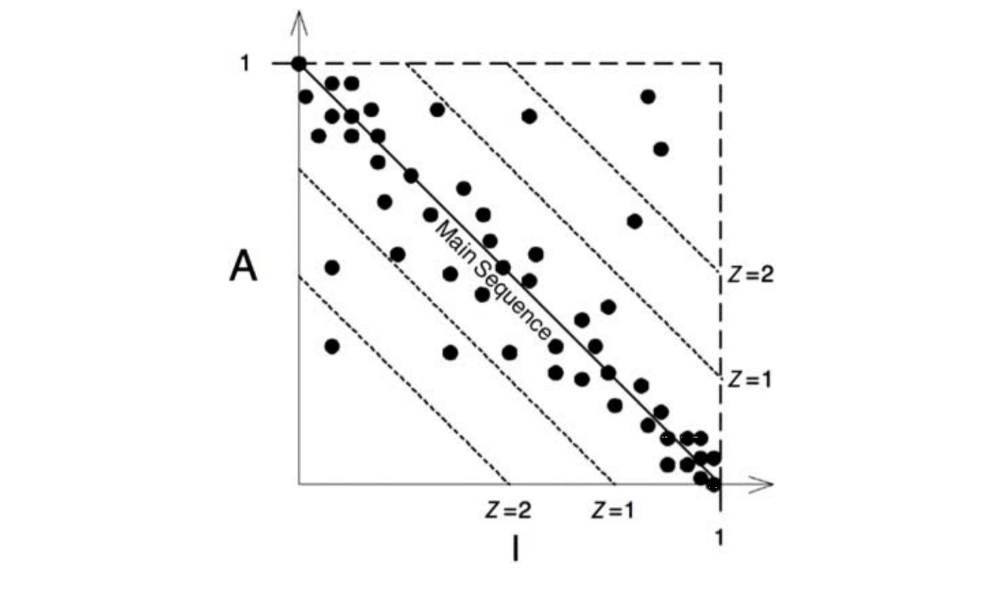

We see in the scatterplot above that most components lie along the Main Sequence. However, some are more than one standard deviation (`Z = 1`) away from the mean. These components are worth examining more closely.

We can also plot the `D` metric of each component over time. See the image below for an example.

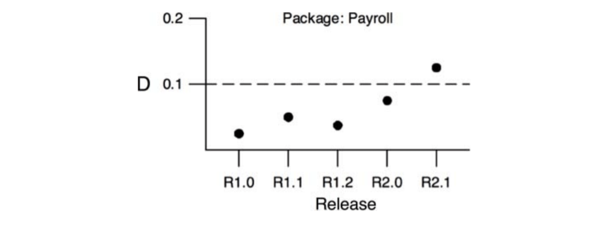

We can see that over time dependencies have been creeping into `Payroll`. There is a control threshold at `D = 0.1`. The `R2.1` exceeded this limit, so it is worth looking at why.
