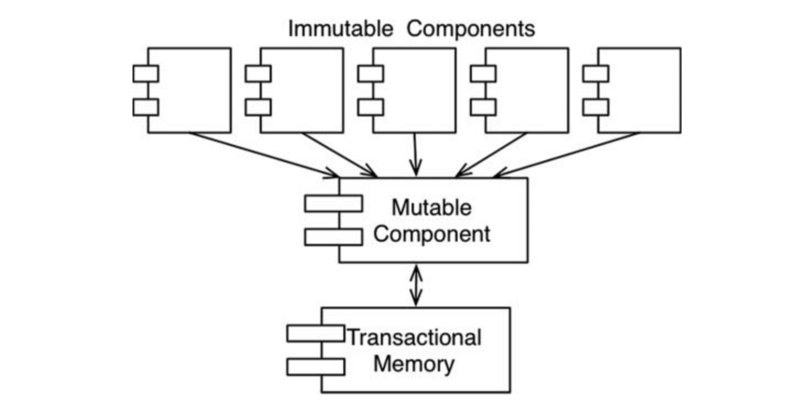

# :heavy_check_mark: Functional Programming


## :round_pushpin: Introduction
`Functional Programming` has only recently begun to get adopted, but it was the first to be invented. A functional statement has no assignment statement. This is strongly based on the &lambda;-calculus invented by Alonzo Church.

Most functional languages do have some means to alter the value of a variable, but only under very strict discipline.

> Functional programming imposes discipline upon assignment.

Functional Programming is based on the concept of mathematical functions. It is a declarative programming paradigm. This means that instead of specifying the steps that a program should take to achieve a particular outcome, you specify what the program should achieve, and the programming language takes care of the implementation details.

The idea is that a program is a set of functions that take input and produce output, without any side effects or mutable state. In functional programming, functions are first-class citizens, which means they can be passed as arguments to other functions, returned as values, and stored in variables.

## :round_pushpin: Background
`Functional Programming` is a programming paradigm where programs are constructed by applying and composing functions. It is a declarative programming paradigm in which function definitions are trees of expressions that map values to other values, rather than a sequence of imperative statements which update the running state of the program.

Some functional programming languages:
- Haskell.
- Lisp.
- Clojure.
- Scala.
- F#.

Many languages support functional programming:
- Java.
- Python.
- JavaScript.

## :round_pushpin: Example
Examples will be written in JavaScript. Here, the three concepts of functional programming are explained.

1. Keep your data and functions separate:
```js
// Non functional programming.
let score = 5;

function addScore() {
  score = score + 10;
  return score;
}

// Functional programming.
function addScore(score) {
  return score + 10;
}
```

2. Avoid changing the state of variables. Rather, create new variables.
```js
// Non functional programming.
let message = "hi";
message = "hi there";
message = "hi there everyone!";

// Functional programming.
let message = "hi";
let secondMessage = "hi there";
let thirdMessage = "hi there everyone!";
```

3. Accept functions and references as parameters.
```js
// Non functional programming.
const score = 10;
const name = "John";

// Functional programming.
const addScore = function() { ... }   // Assigns functions to variable.
sayHello(function() { ... }) { ... }  // Accepts functions as param.
sayHello(function() { ... }) {        // Returns functions.
  return function() { ... }
}
```

## :round_pushpin: Squares of Integers
An example below is a simple function to print the squares of the first 25 integers:

```java
public class Squint {
  public static void main(String[] args) {
    for (int i = 0; i < 25; i++) {
      System.out.println(i * i);
    }
  }
}
```

This Java program uses a *mutable variable*, which is a variable that changes state during the execution of the program. This variable is `i`. These mutable variables do not exist in Clojure (a functional programming language).

So, variables in functional languages **do not vary**.

## :round_pushpin: Immutability and Architecture
Why is mutable variables important to consider?

Mutable variables cause race conditions, deadlock conditions, and concurrent update problems.

You want to make sure that your system you design will be robust in the presence of multiple threads and processors. But is immutability practical? Yes, *if* you have infinite storage and processing speed. If not, then yes only if *certain* compromises are made.

Here are some compromises below.

### Segregation of Mutability
We can segregate the application into mutable and immutable components.

The immutable components perform their tasks in a purely functional way, without using any mutable variables. They communicate with one or more other components that are not purely functional and allows the state of variables to be mutated.



We protect the mutable variables from concurrent updates and race conditions by using some kind of `transactional memory`.

Transactional memory protects variables with a transaction or retry-based scheme. This is the same way a database treats records on disk.

Well-structured applications will be segregated into those components that do not mutate variables and those that do.

Architects should push processing into immutable components as much as possible, and drive code out that allows mutations.

### Event Sourcing
The more memory and processing speed we have, the less there is for the need of mutable variables.

Imagine a banking app that maintains account balance of customers. These balances are mutated when deposits and withdrawals happen.

Imagine if we only stored the transactions. Whenever someone wants to know the balance, we just add all transactions. This requires **no** mutable variables.

This sounds unreasonable because the number of transactions will grow over time, and the processing power required will need to grow. To make this work, we need infinite storage and processing speed.

Perhaps we have enough storage and processing power to make this work for the reasonable lifetime of the application. This is the idea behind `event sourcing`. This is where we store the *transactions* and not the *state*. When state is needed, we apply all transactions since the beginning of time.

If we have infinite everything, we can make it *entirely functional*. This is the way our source code control system works.

## :round_pushpin: Features
Key features:
- Immutability.
- Higher-order functions.
- Pure functions.
- Recursion.
- Lazy evaluation.
- Pattern matching.
- Algebraic data types.
- Type inference.

## :round_pushpin: Benefits and Downsides
There are many **benefits**:
- Easier to reason about.
- Concurrency and parallelism.
- Modularity and reusability.
- Safer code.

There are also **downsides**:
- Steep learning curve.
- Performance issues.
- Limited ecosystem.
- Hard to integrate with imperative code.

## :round_pushpin: Applications
- Finance.
- Scientific Computing.
- Web development.
- Artificial intelligence and machine learning.
- Distributed systems.
- Gaming.

## :round_pushpin: Supplemental Sources
1. [Wikipedia](https://en.wikipedia.org/wiki/Functional_programming)
2. [YouTube - Hitesh Choudhary](https://www.youtube.com/watch?v=dAPL7MQGjyM)
3. [YouTube - BasicOverflow](https://www.youtube.com/watch?v=08CWw_VD45w)
4. [YouTube - GOTO Conferences](https://www.youtube.com/watch?v=0if71HOyVjY)
    - Good video.
