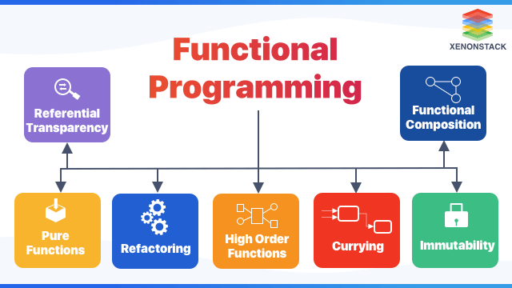

# :heavy_check_mark: Functional Programming



## :round_pushpin: Introduction
`Functional Programming` has only recently begun to get adopted, but it was the first to be invented. It is the direct result of the work of Alonzo Church. A functional statement has no assignment statement.

Most functional languages do have some means to alter the value of a variable, but only under very strict discipline.

> Functional programming imposes discipline upon assignment.

Functional Programming is based on the concept of mathematical functions. It is a declarative programming paradigm. This means that instead of specifying the steps that a program should take to achieve a particular outcome, you specify what the program should achieve, and the programming language takes care of the implementation details.

The idea is that a program is a set of functions that take input and produce output, without any side effects or mutable state. In functional programming, functions are first-class citizens, which means they can be passed as arguments to other functions, returned as values, and stored in variables.

## :round_pushpin: Background
`Functional Programming` is a programming paradigm where programs are constructed by applying and composing functions. It is a declarative programming paradigm in which function definitions are trees of expressions that map values to other values, rather than a sequence of imperative statements which update the running state of the program.

Some functional programming languages:
- Haskell.
- Lisp.
- Clojure.
- Scala.
- F#.

Many languages support functional programming:
- Java.
- Python.
- JavaScript.

## :round_pushpin: Example
Examples will be written in JavaScript. Here, the three concepts of functional programming are explained.

1. Keep your data and functions separate:
```js
// Non functional programming.
let score = 5;

function addScore() {
  score = score + 10;
  return score;
}

// Functional programming.
function addScore(score) {
  return score + 10;
}
```

2. Avoid changing the state of variables. Rather, create new variables.
```js
// Non functional programming.
let message = "hi";
message = "hi there";
message = "hi there everyone!";

// Functional programming.
let message = "hi";
let secondMessage = "hi there";
let thirdMessage = "hi there everyone!";
```

3. Accept functions and references as parameters.
```js
// Non functional programming.
const score = 10;
const name = "John";

// Functional programming.
const addScore = function() { ... }   // Assigns functions to variable.
sayHello(function() { ... }) { ... }  // Accepts functions as param.
sayHello(function() { ... }) {        // Returns functions.
  return function() { ... }
}
```

## :round_pushpin: Features
Key features:
- Immutability.
- Higher-order functions.
- Pure functions.
- Recursion.
- Lazy evaluation.
- Pattern matching.
- Algebraic data types.
- Type inference.

## :round_pushpin: Benefits and Downsides
There are many **benefits**:
- Easier to reason about.
- Concurrency and parallelism.
- Modularity and reusability.
- Safer code.

There are also **downsides**:
- Steep learning curve.
- Performance issues.
- Limited ecosystem.
- Hard to integrate with imperative code.

## :round_pushpin: Applications
- Finance.
- Scientific Computing.
- Web development.
- Artificial intelligence and machine learning.
- Distributed systems.
- Gaming.

## :round_pushpin: Supplemental Sources
1. [Wikipedia](https://en.wikipedia.org/wiki/Functional_programming)
2. [YouTube - Hitesh Choudhary](https://www.youtube.com/watch?v=dAPL7MQGjyM)
3. [YouTube - BasicOverflow](https://www.youtube.com/watch?v=08CWw_VD45w)
4. [YouTube - GOTO Conferences](https://www.youtube.com/watch?v=0if71HOyVjY)
    - Good video.
