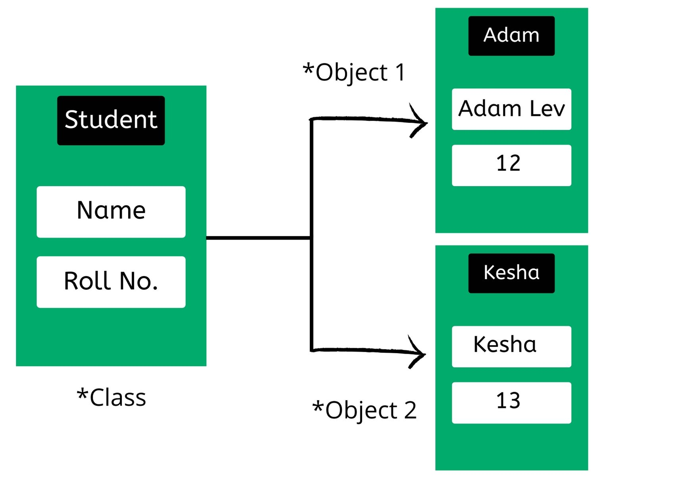

# :heavy_check_mark: Object-Oriented Programming

## :round_pushpin: Introduction
Second paradigm to be adopted was the `Object-Oriented Programming (OOP)` paradigm. It was discovered by Ole Johan Dahl and Kristen Nygaard. They noticed that the function call stack frame in the `ALGOL` language could be moved to a heap, allowing local variables declared by a function to exist long after the function returned.

This function became a constructor for a class, the local variables became instance variables, and the nested functions became methods.

This led to the discovery of `polymorphism` through the use of function pointers.

> Object-oriented programming imposes discipline on indirect transfer of control.

## :round_pushpin: Background
OOP is based on the concept of `objects` which can contain data and code. The data is in the form of `fields` (attributes and properties), and the code is in the form of `procedures` (methods).

OOP emphasizes the use of objects and classes to structure code and data. OOP is a way of organizing code that allows for more efficient and modular programming, making it easier to maintain and reuse code.

Everything in OOP is labeled as an object, which is an instance of a class. A class is a blueprint that defines the characteristics and behaviors of an object. Objects have state (data) and behavior (methods) that can be accessed and manipulated through well-defined interfaces.

## :round_pushpin: Features
Key features:
- Encapsulation: The practice of bundling data and methods within a class and restricting access to them from outside the class.
- Inheritance: Allows one class to inherit properties and methods from another, reducing code duplication and making it easier to create new classes based on existing ones.
- Polymorphism: Allows different objects to be treated as if they were the same type, making it easier to write code that works with multiple types of objects.

## :round_pushpin: Benefits and Downsides
There are many **benefits** to using OOP:
- Code reuse.
- Improved modularity.
- Easier maintenance.
- Encapsulation.
- Inheritance.
- Polymorphism.

There are also **downsides** to using OOP:
- Complexity.
- Performance.
- Over-engineering.
- Overuse.

## :round_pushpin: Applications
There are various applications of OOP:
- Desktop and mobile applications.
- Video games.
- Web applications.

## :round_pushpin: Supplemental Sources
1. [Wikipedia](https://en.wikipedia.org/wiki/Object-oriented_programming)
