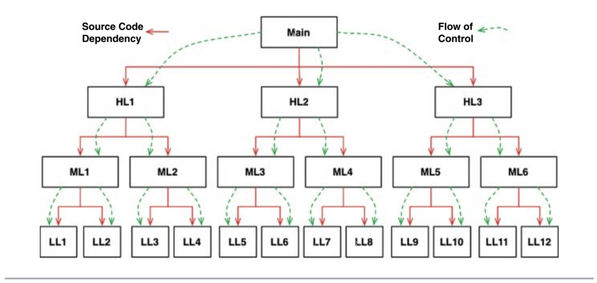
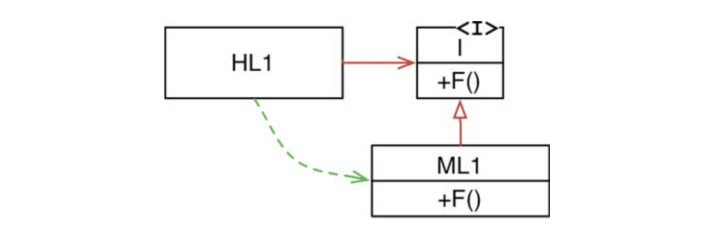
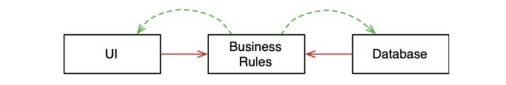

# :heavy_check_mark: Object-Oriented Programming


## :round_pushpin: Introduction
Second paradigm to be adopted was the `Object-Oriented Programming (OOP)` paradigm. It was discovered by Ole Johan Dahl and Kristen Nygaard. They noticed that the function call stack frame in the `ALGOL` language could be moved to a heap, allowing local variables declared by a function to exist long after the function returned.

This function became a constructor for a class, the local variables became instance variables, and the nested functions became methods.

This led to the discovery of `polymorphism` through the use of function pointers.

> Object-oriented programming imposes discipline on indirect transfer of control.

## :round_pushpin: Background
There are *three* words that we can use to describe OO:
1. `Encapsulation`
2. `Inheritance`
3. `Polymorphism`

The idea is that OO is the mixture of these three things or that an OO language must support these three things.

OOP is based on the concept of `objects` which can contain data and code. The data is in the form of `fields` (attributes and properties), and the code is in the form of `procedures` (methods).

OOP emphasizes the use of objects and classes to structure code and data. OOP is a way of organizing code that allows for more efficient and modular programming, making it easier to maintain and reuse code.

Everything in OOP is labeled as an object, which is an instance of a class. A class is a blueprint that defines the characteristics and behaviors of an object. Objects have state (data) and behavior (methods) that can be accessed and manipulated through well-defined interfaces.

## :round_pushpin: Features
Key features:
- Encapsulation: The practice of bundling data and methods within a class and restricting access to them from outside the class.
- Inheritance: Allows one class to inherit properties and methods from another, reducing code duplication and making it easier to create new classes based on existing ones.
- Polymorphism: Allows different objects to be treated as if they were the same type, making it easier to write code that works with multiple types of objects.

### Encapsulation
`OO` languages provide each and effective encapsulation of data and function.

A line can be drawn around a cohesive set of data and functions. Outside of that line, the data is *hidden* and only some of the functions are known.

This concept is known as the *private data members* and the *public member functions* of a class.

This idea is *not* unique to `OO`. We had encapsulation in `C`.

The idea is that the users of a public member function will have no idea about *how* the function is implemented. They simply call the function and something happens.

`C` is *not* an `OO` language and performs encapsulation perfectly. The client will never know about the private member variables because the header files and implementation files are *separate*.

However, in `C++`, this is broken. Here, the header files required that the private member variables be declared in the header file. This allows the client to see the private variables.

The variables `private`, `public`, and `protected` were introduced to mitigate this. But this was more of a *hack*.

It is difficult to accept that `OO` depends on strong encapsulation. Many `OO` languages have little or no enforced encapsulation. So, it is up to the user to *enforce* the standards of encapsulation.

### Inheritance
Inheritance is the redeclaration of a group of variables and functions within an enclosing scope.

`C` programmers were able to do this manually for quite some time.

In modern languages, if a subclass inherits from a superclass, the subclass can *act* as a subset of a superclass. Usually, in modern languages, this is done via **implicit casting**.

For example, if the `NamedPoint` class inherited from the `Point` class, a `NamedPoint` object is a `Point` object.

`OO` did not necessarily give us the concept of inheritance. It was around long before the advent of `OO` languages.

### Polymorphism
We had polymorphic behaviors before `OO` languages.

`OO` languages made polymorphism safer and convenient. They eliminate the conventions when it comes to tracking pointers to functions. It imposes discipline on indirect transfer of control.

Our programs should be *device independent*. We want our programs to do the same jobs but with *different* devices.

The `plugin architecture` was invented to support the idea of device independence. `OO` allows this to be used anywhere, for anything.

#### Dependency Inversion


The image above is a typical calling tree where the main functions called high-level functions, which called mid-level functions, which called low-level functions.

The source code dependencies followed the flow of control.

So, the main depends on HL functions, the HL functions depend on ML functions, and ML functions depend LL functions.

For `main` to call HL functions, it needs to mention the name of the module that contained the function.

The flow of control was dictated by the behavior of the system, and the source code dependencies were dictated by that flow of control.

When polymorphism is brought into play, something very different can happen.



Here, `HL1` calls `F()` function in `ML1`. It calls this function through an interface. This is called a `source code contrivance`. The interface *does not exist* during runtime. `HL1` calls `F()` within `ML1`.

So, `HL1` depends on the interface. `ML1` inherits the interface and implements `F()` from the interface. `HL1` *calls* the function `F()` in `ML1`.

The green arrows mean "calling" whereas the red arrows mean "depends on". The red skinny arrowhead indicates dependency. The red open-closed arrowhead indicates inheritance.

Notice that the dependency (inheritance relationship) between `ML1` and interface `I` points in the *opposite* direction compared to the flow of control (calling direction). This is called `dependency inversion`.

The `OO` languages can provide safe and convenient polymorphism. So, *any source code dependency, no matter where it is, can be inverted*. Any of the dependencies in the first image above can be inverted by inserting an interface between them.

Because of this, architects working in systems written in `OO` languages have *absolute control* over the direction of all source code dependencies in the system. No longer do they have to align the dependencies with the flow of control. No matter which module is called or does the calling, the architect can point the dependency in either direction.

***This is the power that `OO` provides!***

You can rearrange the source code dependencies of your system so that the database and the UI depend on the business rules, rather than the other way around.



The image above means that the UI and database can be plugins to the business rules. This means that source code of the business rules *never* mentions the UI or the database.

So, the business rules, UI, and the database can be compiled into three separate components or deployment units (e.g. jar files, DLLs, or Gem files) that have the same dependencies as the source code.

The component containing the business rules will not depend on the components containing the UI and database. So, the business rules can be *deployed independently* of the UI and the database. Changes to the Ui and database do not have any effect on the business rules. They can be deployed separately and independently.

When the source code in a component changes, only that component needs to be redeployed. This is `independent deployability`.

This means the modules can be developed independently by different teams. This is `independent developability`.

Overall, `OO` is the ability, through the use of polymorphism, to gain absolute control over every source code dependency in the system. It allows the architect to create a `plugin architecture`.

## :round_pushpin: Example
```java
public class Car {
  private String make;
  private String model;
  private int year;

  public Car(String make, String model, int year) {
    this.make = make;
    this.model = model;
    this.year = year;
  }

  public String getMake() {
    return make;
  }

  public String getModel() {
    return model;
  }

  public int getYear() {
    return year;
  }

  public void start() {
    System.out.println("The " + make + " " + model + " is starting.");
  }

  public void stop() {
    System.out.println("The " + make + " " + model + " is stopping.");
  }
}
```

Here, we have a class called `Car`. It has three instance variables: `make`, `model`, and `year`. This class also has a constructor that takes these variables as parameters and sets them to the instance variables. There are also methods in this class as well.

We can make `Car` objects with this blueprint.

```java
Car myCar = new Car("Toyota", "Camry", 2018);
System.out.println(myCar.getMake()); // Output: Toyota
System.out.println(myCar.getModel()); // Output: Camry
System.out.println(myCar.getYear()); // Output: 2018
myCar.start(); // Output: The Toyota Camry is starting.
myCar.stop(); // Output: The Toyota Camry is stopping.
```

## :round_pushpin: Benefits and Downsides
There are many **benefits** to using OOP:
- Code reuse.
- Improved modularity.
- Easier maintenance.
- Encapsulation.
- Inheritance.
- Polymorphism.

There are also **downsides** to using OOP:
- Complexity.
- Performance.
- Over-engineering.
- Overuse.

## :round_pushpin: Applications
There are various applications of OOP:
- Desktop and mobile applications.
- Video games.
- Web applications.

## :round_pushpin: Supplemental Sources
1. [Wikipedia](https://en.wikipedia.org/wiki/Object-oriented_programming)
