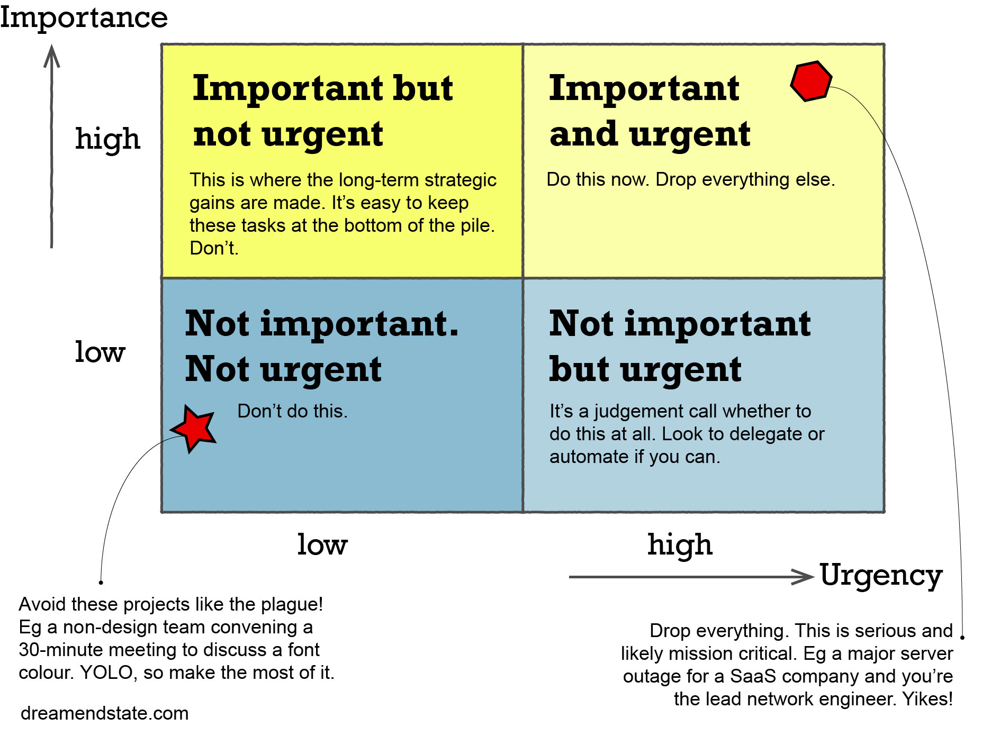

# :heavy_check_mark: Software Architecture

## :round_pushpin: Introduction
`Software Architecture` refers to the fundametal organization of a software system and the key principles and decisions that guide its design and development. It encompasses the high-level structure of a software system and defines the components, relationships, and interactions between them.

It can be thought of as the blueprint for a software system, laying out the overall structure and design of the system before any code is written. It involves identifying the key components of the system, defining their responsibilities and interactions, and specifying the interfaces and protocols that govern how they communicate.

It is critical for building large, complex software systems that are *reliable*, *maintainable*, and *scalable*. It helps ensure the system is designed to meet the needs of its users and stakeholders, and that it can evolve and adapt over time as requirements change.

Software architecture is a board and multifaceted field, encompassing many approaches and methodologies. Some common architectural styles include `layered architecture`, `client-server architecture`, `microservices architecture`, and `event-driven architecture`. There are more.

## :round_pushpin: Design and Architecture
What are the differences between design and architecture? They are pretty much the same thing:
- `Architecture` is used in context of something at a high level that is separate from the lower-level details.
- `Design` implies structures and decisions at a lower level.

The low-level details and high-level decisions are all part of the same whole. They define the shape of the system.

Developing fast is not necessarily the best way to build something. Overconfidence in developers can build over time, and the cost to maintain and develop more features will outweigh the benefit of more engineers/code.

This is why we need a design and architecture that minimize effort and maximize productivity.

## :round_pushpin: Two Values
Every software system provides two different values to the stakeholders: `behavior` and `structure`. Often one of the values is focused on over the other.

### Behavior
This value is to make systems behave in the way they're supposed to.

### Architecture
Behavior of machines must be easy to change. This is what `software` is supposed to help do.

The difficulty in making a change should be proportional only to the scope of the change and not to the *shape* of the change.

Architectures should be as **shape agnostic** as possible.

### Behavior vs Architecture
Which of these two values is more important? Is it more important for the software system to work? Or more important for the software system to be easy to change?

The former is the *wrong attitude*.

Some systems are impossible to change because the cost of change exceeds the benefits of the change.

### Eisenhower's Matrix
Matrix of importance versus urgency

- Behavior is **urgent** but not always important.
- Architecture is **important** but never urgent.

Therefore there are 4 priorities:
1. Urgent and important.
2. Not urgent and important.
3. Urgent and not important.
4. Not urgent and not important.

Architecture pertains to 1 and 2. Behavior pertains to 1 and 3. Often business managers and devs elevate items in 3 to 1.

It is the responsibility of the development team to assert the importance of architecture over the urgency of features.

## :round_pushpin: Programming Paradigms
Paradigms are ways of programming, relatively unrelated to languages. A paradigm tells you which programming structures to use, and when to use them.

To date, there have been 3 paradigms. The paradigms are `structured programming`, `object-oriented programming`, and `functional programming`.

See more detailed explanation:
1. [Structured Programming](programming-paradigms/structured-programming.md)
2. [Object-Oriented Programming](programming-paradigms/object-oriented-programming.md)
3. [Functional Programming](programming-paradigms/functional-programming.md)

## :round_pushpin: Key Points
Here are some key points to understand in architecture:
- Getting software to work is *easy*, but getting software **right** is **hard**.
- Writing messy code fast is always slower than staying clean.

## :round_pushpin: Supplemental Sources

