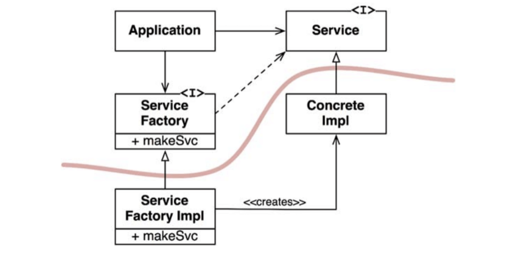

# :heavy_check_mark: DIP: The Dependency Inversion Principle

## :round_pushpin: Introduction
The DIP principle tells us that the most flexible systems are those where source code dependencies refer only to **abstractions**, not **concretions**.

This means, in statically-typed languages, the `import` statements should only refer to modules containing `interfaces`, `abstract classes`, or some `abstract declaration`, **nothing concrete**.

In dynamically-typed languages, it is much harder to define what *concrete* is. It is any module in which the functions being called are implemented.

There are some concrete dependencies that are *okay* to depend on. It is like the Java's `String` class. We know and can trust that this class will *rarely* change, and is tightly protected.

We need to worry about depending on modules that *change frequently*.

## :round_pushpin: Stable Abstractions
Changes to an abstract interface means we need to change its concrete implementations. Changes to concrete implementations do not always require changes to the interfaces that they implement. Interfaces are therefore less volatile.

It is important to add functionality that limits changes to the interface. This is Software Design 101.

Stable software architectures are those that avoid depending on volatile concretions, and use stable abstract interfaces. Basically, we should follow these sets of practices:
- **Don't refer to volatile concrete classes.** Refer to abstract interfaces. This rule applies to all languages. It puts constraints on the creation of objects and enforces the use of `Abstract Factories`.
- **Don't derive from volatile concrete classes.** Inheritance is strong in statically-typed languages. It should be used with great care. In dynamically-typed languages, inheritance is less of a problem. However, it is *still* a dependency. Use with caution.
- **Don't override concrete functions.** Concrete functions sometimes require code dependencies. When overriding those functions, those dependencies are **not** eliminated. They are **inherited**. To manage dependencies, make the function abstract and create multiple implementations.
- **Never mention the name of anything concrete and volatile.** Exactly what it sounds like.

## :round_pushpin: Factories
The creation of volatile concrete objects needs special handling.

In all languages, the creation of an object requires code dependency on the concrete *definition* of that object. We would use an `Abstract Factory` to manage this undesirable dependency.

See the image below.

The `Application` uses `ConcreteImpl` through the `Service` interface. This `Application` needs to create instances of `ConcreteImpl`.

To do this without creating code dependency on `ConcreteImpl`, the `Application` calls the `makeSvc` function of the `ServiceFactory` interface. This function is implemented by `ServiceFactoryImpl` class that derives from `ServiceFactory`. This implementation instantiates the `ConcreteImpl` and returns it as a `Service`.

The red line is an `architectural boundary`. It separates the abstract from the concrete. All code dependencies cross that line in the **same** direction, toward the abstract side.

The curved line divides the system between the abstract and the concrete components. The abstract component contains all the high-level business rules. The concrete component has all the implementation details that those business rules manipulate.

The flow of control crosses the line in the **opposite** direction of the code dependencies. The dependencies are inverted against flow of control. This is `Dependency Inversion`.

## :round_pushpin: Concrete Components

The concrete component above contains a single dependency. It violates the DIP. This is normal. DIP violations cannot be *entirely* removed. They can, however, be gathered into a small number of concrete components and kept separate from the rest.

Most systems contain at least *one* concrete component, often called `main`. The `main` function would instantiate the `ServiceFactoryImpl` and place that instance in a global variable of type `ServiceFactory`. The `Application` accesses the factory through that global variable.
