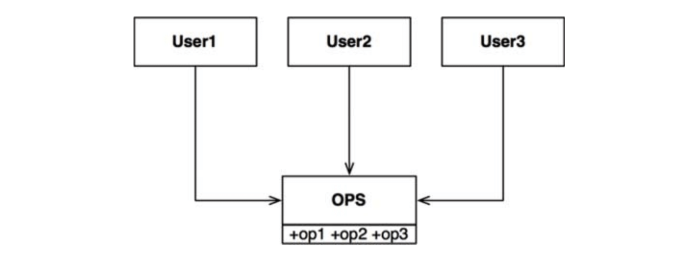
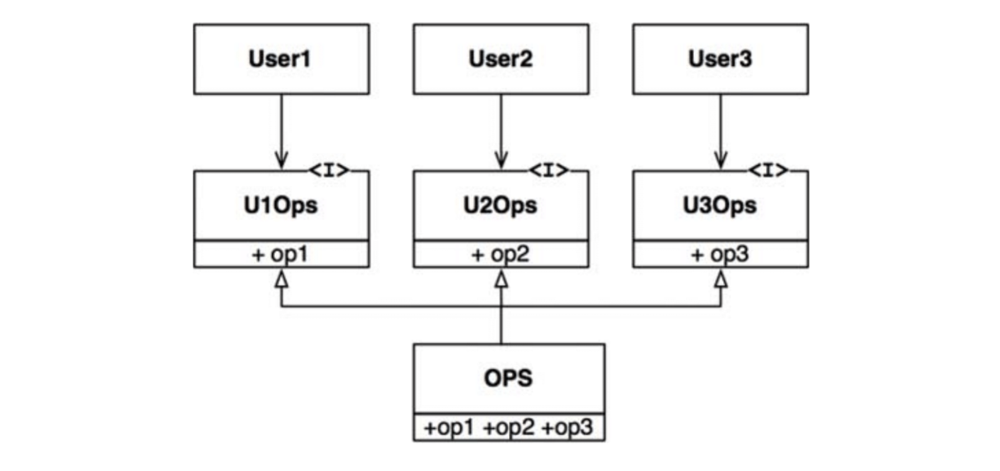

# :heavy_check_mark: ISP: The Interface Segregation Principle

## :round_pushpin: Introduction
See the diagram below.

There are several users who use operations in the `OPS` class. Assume `User1` uses `op1`, `User2` uses `op2`, and `User3` uses `op3`.

The code of `User` will inadvertently depends on `op2` even though it *does not* call it. `User1` will need to be recompiled and redeployed for every change that happens to `op2`.

This is resolved by segregating operations into interfaces as shown below.

So, the code of `User1` will depend on `U1Ops` and `op1`, but not `OPS`. So, if there is a change to `OPS` that `User1` *does not* care about, `User1` will **not** be recompiled and redeployed.

## :round_pushpin: ISP and Language
In `statically-typed` languages, users need to `import` code from other files. This creates code dependencies, which in turn, causes recompilation and redeployment.

In `dynamicall-typed` languages, users *do not* need to import code. So, there is no code dependency. So, these languages create systems that are more flexible and less tightly coupled.

This may give the idea that ISP pertains to the *type* of language that is used.

## :round_pushpin: ISP and Architecture
It is harmful in general to depend on modules that have more than you need.

Suppose that an architect is working on a system. They want to include a framework. So, the system depends on the framework, and the framework depends on the database.

Say the database contains features that the framework *does not* use and care about. Changes to the database to those features causes the redeployment of the framework, and therefore redeployment of the system. Even worse, a failure of the database may lead to the failure of the framework and the system.
