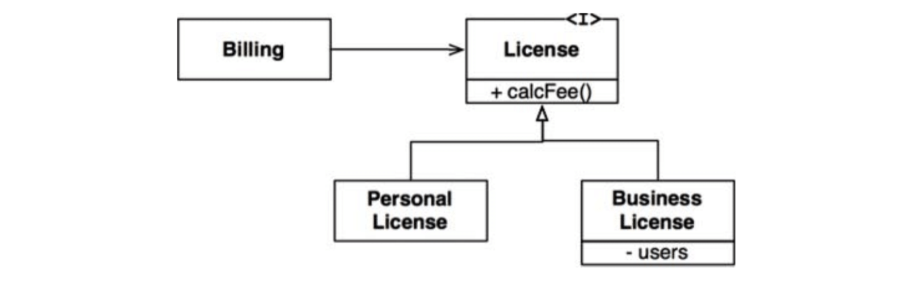
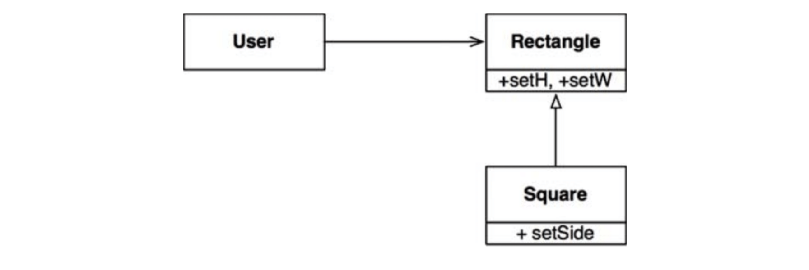

# :heavy_check_mark: LSP: The Liskov Substitution Principle

## :round_pushpin: Introduction
Barbara Liskov wrote the following about subtypes:

>*What is wanted here is something like the following substitution property: If for each object o1 of type S there is an object o2 of Type T such that for all programs P defined in terms of T, the behavior of P is unchanged when o1 is substituted for o2 then S is a subtype of T.*

## :round_pushpin: Guiding The Use Of Inheritance


We have a class called `License`. It has a method called `calcFee()`, which is called by the `Billing` application. There are two "subtypes" of `License`. These are `PersonalLicense` and `BusinessLicense`.

Both subtypes are substitutable for the `License` type, so it *does not matter* which type the `Billing` application will use.

## :round_pushpin: The Square/Rectangle Problem


`Square` is *not* a proper subtype of `Rectangle` because the height and width of the `Rectangle` are *independently mutable*. The height and width of a `Square` must *change together*. The `User` might believe it is communicating with a `Rectangle` and get confused.

```java
Rectange r = ...
r.setW(5);
r.setH(2);
assert(r.area() == 10);
```

If the `...` code actually produced a `Square`, the assertion would fail. This is because *not all* rectangles can be squares.

A way to defend against this, we can add checks to the `User` that checks whether the `Rectangle` is actually a `Square`. The behavior of the `User` now depends on the *types* it uses, so those types are **not** substitutable.

## :round_pushpin: LSP and Architecture
LSP can be used as a guide for the use of inheritance. But, it turned into a broader principle of software design that pertains to interfaces and implementations.

There are users that depend on well-defined interfaces, and the substitutability of the implementations of those interfaces.

A good way to understand LSP is to see what happens to the architecture when LSP is violated.

## :round_pushpin: Example LSP Violation
We are building an aggregator for many taxi dispatch services. Customers use our site to find a taxi. Once the customer decides, our system dispatches the taxi by using a RESTful service.

Assume the URI for the RESTful dispatch service is part of info in the driver database. After the system chooses a driver, it gets the URI from the driver record and uses it to dispatch the driver.

Driver Bob has a dispatch URI: `purplecab.com/driver/Bob`

Our system appends dispatch info onto the URI and sends it with a PUT:

```
purplecab.com/driver/Bob
        /pickupAddress/24 Maple St.
        /pickupTime/153
        /destination/ORD
```

This means all taxi companies **must conform** to the same REST interface. They must treat the `pickupAddress`, `pickupTime`, and `destination` fields the same.

Suppose a big taxi company decided to hire devs that *did not* read the specs carefully. They abbreviated the destination field to `dest`. What happens to our architecture?

We need to add a special case. Dispatch requests for the big taxi company would be different. We could just add an `if` statement to the code that constructs the dispatch command.

However, any architect would **not** approve of this design. We **cannot** have the name of the big taxi company in the code.

Say the big taxi company bought out another taxi company. What if they maintained things separately even after the acquisition, but unified the original company's systems? Do we need another `if` statement for the new taxi company?

The achitect needs to insulate the system from bugs by creating a dispatch command creation module. This is driven by a config database keyed by the dispatch URI. The config data might look like:


Notice how the architect is **forced** to create a mechanism to deal with the fact that the interfaces of the RESTful services **are not all substitutable**.
