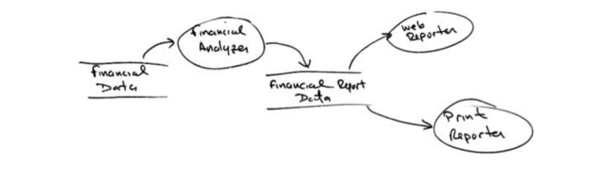
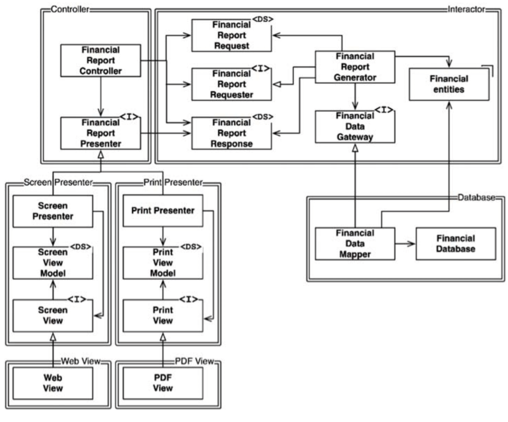
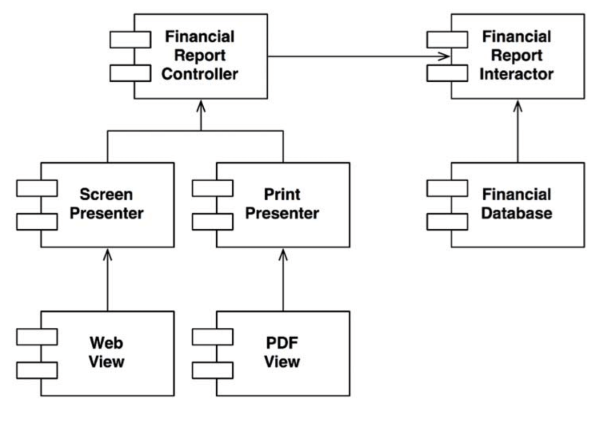

# :heavy_check_mark: OCP: The Open-Closed Principle

## :round_pushpin: Introduction
This principle says:

> A software artifact should be open for extension but closed for modification.

The behavior of a software artifact should be extendible, without having to modify the artifact.

We shouldn't have to change existing code to extend new features. Massive changes to existing code represents a failure on the architect's part.

See the following though experiment.

## :round_pushpin: A Thought Experiment
Imagine we have a web page that displays financial summary. We can scroll up and down. Negative numbers are rendered in red.

Say that some stakeholders want this information turned into a report. The report should be paginated, have page headers, page footers, and labels. Negative numbers should be in parentheses.

New code must be written, but how much old code should be changed?

A good architecture reduces changes to a minimum. But how? By separating things that change for different reasons (SRP), and then organizing the dependencies between those things (DIP).

The image below shows the SRP in action. The data flow shows an analysis procedure inspecting financial data which produces a financial data report. This report is formatted by two report processes.

Generating the report involves two separate responsibilities:
1. Calculating the reported data and
2. Presenting the data into a web- and printer-friendly form.

We need to organize the code dependencies to ensure that changes to one responsibility **does not** cause changes in the other.

We do this by partitioning the processes into classes, and separating the classes into components. Components are separated by double-lines in the image below.

The top-left component is the `Controller`. We have the `Interactor` at the top-right. The lower-right is the `Database`. The lower-left has four components that represents the `Presenters` and `Views`.

Classes with `<I>` are interfaces. Those marked with `<DS>` are data structures. Open arrowheads are *using* relationships. Closed arrowheads are *implements* or *inheritance* relationships.

All dependencies are *source code* dependencies. Arrows pointing from class A to class B means that the source code of A mentions the name of B, but B mentions nothing about A. So, in the image above, `FinancialDataMapper` knows about `FinancialDataGateway` through an *implements* relationship. However, `FinancialDataGateway` knows nothing about `FinancialDataMapper`.

Each double line is crossed *in one direction only*. All component relationships are **unidirectional**. Below is a component graph. These arrows point toward the components that we want to protect from change.

If component A should be protected from changes in B, B should depend on A.

We want to protect the `Controller` from changes in the `Presenters`. Protect the `Presenters` from the `Views`. Protect `Interactors` from changes in anything. The `Interactor` conforms best to OCP. Changes to the `Database`, `Controllers`, `Presenters`, or `Views` will have **no** impact on the `Interactor`.

The `Interactor` is in an important position because it has the business rules. It contains the highest-level policies. All other components are dealing with peripheral concerns. The `Interactor` deals with central concerns.

Being central and/or peripheral is all about perspective. The `Controller` is central to the `Presenters` and `Views`. This creates a hierarchy of protection based on the "level".

This is how OCP works at the architectural level. Architects separate functionality based on how, why, and when it changes. They then organize that separated functionality into a hierarchy of components. Higher-level components in that hierarchy are protected from changes in the lower-level components.

## :round_pushpin: Directional Control

The component diagram just ensures that we are pointing the dependencies in the correct direction.

Notice that `FinancialDataGateway` interface between the `FinancialReportGenerator` and the `FinancialDataMapper` is there to invert the dependency that would otherwise have pointed from the `Interactor` to the `Database`.

## :round_pushpin: Information Hiding

The `FinancialReportRequester` is different. It protects the `FinancialReportController` from knowing too much about the internals of the `Interactor`. If it were **not** there, then the `Controller` would have transitive dependencies on `FinancialEntities`.

Software entities should not depend on things they don't need directly.

So, even though we want to protect the `Interactor` from the changes to the `Controller`, we also want to protect the `Controller` from changes to the `Interactor` by hiding the internals of the `Interactor`.
