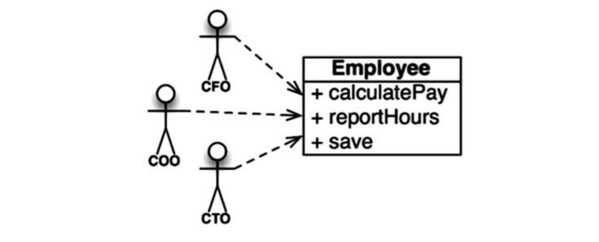
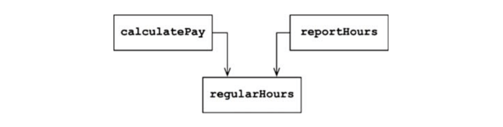
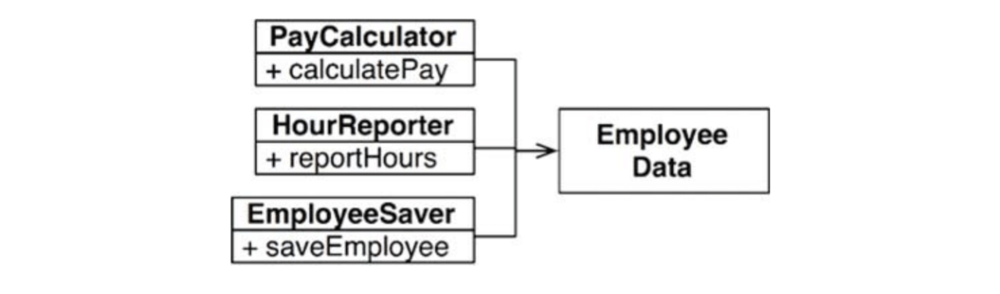
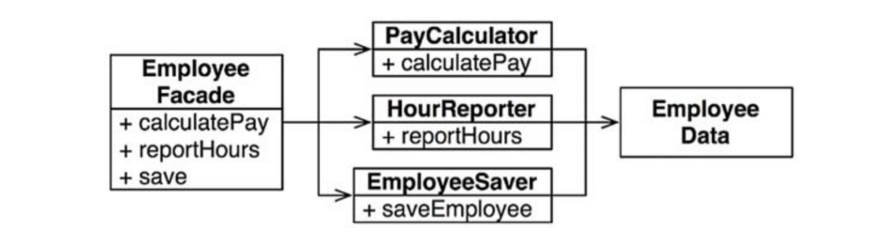

# :heavy_check_mark: SRP: The Single Responsibility Principle

## :round_pushpin: Introduction
This principle is often the least understood. People see the name and think that it should just "do one thing".

There *is* a principle like that. A *function* should do one thing. This is seen when we refactor large functions into smaller functions. However, this is **not** the SRP.

The SRP is sometimes stated as:

> A module should have one, and only one, reason to change.

Software systems are changed to satisfy users and stakeholders. They *are* the "reason to change". We can rephrase the above:

> A module should be responsible to one, and only one, user or stakeholder.

However, there may be one or more users and stakeholders, so we refer to them as groups or an *actor*. The final version is:

> A module should be responsible to one, and only one, actor.

Simplest definition of module is a "source file". In some cases, a module is a cohesive set of functions and data structures.

Cohesion binds together code responsible to a single actor.

Let's look at the symptoms that violate it.

## :round_pushpin: Symptom 1: Accidental Duplication
An example is an `Employee` class from a payroll app. It has three methods: `calculatePay()`, `reportHours()`, and `save()`. See the image below.

Notice that this class *violates* the SRP because those three methods are responsible to **three** different actors.
- The `calculatePay()` is specified by the accounting department, which reports to the CFO.
- The `reportHours()` is specified and used by the HR department, which reports to the COO.
- The `save()` method is specified by database administrators (DBAs), who report to the CTO.

Putting the code for these three methods into a single `Employee` class coupled each of these actors to the others.

Coupling causes actions of the CFO's team to affect something that the COO's team depends on.

Pretend the `calculatePay()` and `reportHours()` function share a common algorithm for calculating non-overtime hours. Also, pretend the devs didn't want to duplicate code. So, they placed the logic inside a function called `regularHours()`. See the image below.

Suppose the CFO wants to change how the non-overtime hours are calculated. However, the COO's team does not want this change.

A dev tries to make the change. They see the `regularHours()` function called by `calculatePay()`, but they fail to see the `reportHours()` function calling it as well.

This change is made. The CFO is happy, but the COO is **not** because this change costed them a lot of money.

These problems occur because we put code that different actors depend on into close proximity. The SRP says to *separate the code that different actors depend on*.

## :round_pushpin: Symptom 2: Merges
When dealing with source files with multiple methods that are responsible to different actors, merging will be common.

Say that the CTO's team wants to make a schema change to the `Employee` table of the database. Also suppose the COO's team wants to make changes to the format of the hours report.

Two different devs will checkout the `Employee` class and make changes. Their changes will collide, and results in a merge.

The way to avoid this problem is to *separate code that supports different actors*.

## :round_pushpin: Solutions
Move the functions into different classes.

The most obvious way is to separate the data from the functions. Three classes share access to `EmployeeData` which is a data structure with no methods.

Each class holds the necessary code for its function. The three classes **do not** know about each other. Any accidental duplication is avoided. See the image below.

However, now devs have to track and instantiate three different classes. A solution is to use the `Facade` pattern:

The facade has little code. It is responsible for instantiating and delegating to the classes with the functions.

It is often favorable to keep important business rules closer to the data. This is done by keeping important methods in the `Employee` class while using it as a *Facade* for lesser functions:

Each class would have many private methods in them. Each classes that have a family of methods is a **scope**. Outside of this scope, no one knows the private members of the family exist.
