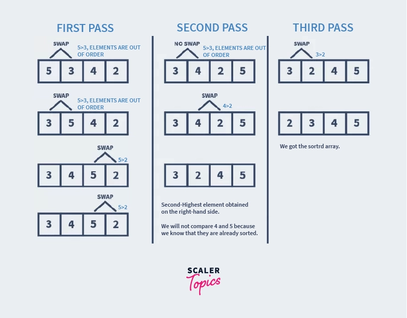

# :heavy_check_mark: Bubble Sort
*Last Updated: 1/28/2023*




## :round_pushpin: TLDR
**Time Complexity:** <code>O(N<sup>2</sup>)</code>

**Space Complexity:** `O(1)`

## :round_pushpin: Summary
- In-place sorting algorithm.
- Simplest sorting algorithm.
- Works by repeatedly swapping adjacent elements if they are in the wrong order.
- Not suitable for large datasets.
- Scans the array from left to right multiple times.
- Doing so creates a sorted partition on the right side.
- After the first iteration, the largest number will be in the right.

## :round_pushpin: Explanation
Simple explanation:
- Think of a line of people.
- You want to arrange them from shortest to tallest.
- Start from the left.
- Compare the first two people (0 and 1).
- Swap them if they are not in ascending order.
- Compare the next two numbers (1 and 2).
- Swap them accordingly.
- After comparing all in the first iteration, the tallest person will be placed on the right.
- You then repeat this process until you sort everyone by height.

## :round_pushpin: Code
The code below can be used to sort in descending order as well. Just change the condition.
```java
public void bubbleSort(int[] arr) {
  // Grab the array length.
  int n = arr.length;

  // Iterate until the second to last spot.
  for (int i = 0; i < n - 1; i++) {
    // Iterate until you hit the sorted portion.
    for (int j = 0; j < n - i - 1; j++) {
      // If the current num and next num are in descending order, swap them.
      if (arr[j] > arr[j + 1]) {
        int temp = arr[j];
        arr[j] = arr[j + 1];
        arr[j + 1] = temp;
      }
    }
  }
}
```
- We iterate each number in the original array.
- Compare the numbers.
- If in descending order, swap them.
- In a way, we are *bubbling* up the largest value of the array on each iteration.
- The right partition will be sorted after each pass.

## :round_pushpin: Advantages
- Simple and easy to understand.
- Does not require memory.
- Adaptable to different types of data.

## :round_pushpin: Disadvantages
- Quadratic complexity makes it very slow for large datasets.
- Not a stable sorting algorithm.
  - This means elements with the same key value may not maintain their relative order in the sorted output.

## :round_pushpin: Analysis
**Time Complexity:** <code>O(N<sup>2</sup>)</code>

**Space Complexity:** `O(1)`
