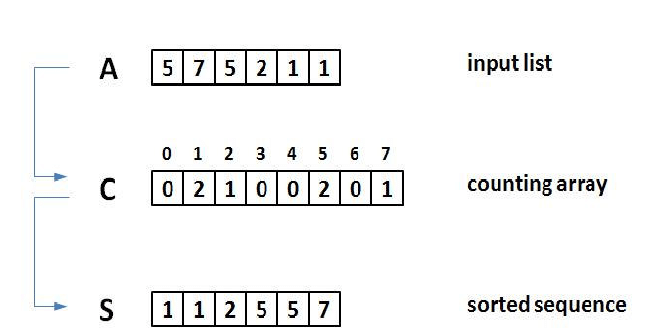

# :heavy_check_mark: Counting Sort
*Last Updated: 1/31/2023*



## :round_pushpin: TLDR
**Time Complexity:** `O(N)`

**Space Complexity:** `O(N)`

## :round_pushpin: Summary
- Counting occurrences.
- Not in-place.
- Stable.
- Sorting technique based on keys between a specific range.
- We know the input is going to be positive integers (or characters).
- Count the number of objects having distinct key values (kind of hashing).
- Do some arithmetic operations to calculate position of each object in the output sequence.
- Makes assumptions about data.
  - Like assuming values will be between 0-10 or 10-99 etc.
  - Input data will be all real numbers.
- Not a comparison-based algorithm.
  - Hashes the value in a temporary count array and uses them for sorting.
  - Uses a temp array making it a non in-place algorithm.

## :round_pushpin: Explanation
- The running sum portion is confusing.
  - The index of the counts array holds the actual numbers from the original array.
  - The counts array holds the frequency of those numbers.
  - We get the running sum.
  - This tells us that the value at the index represents how many values there are that are <= the number (index).
- For example:
```
Original Array: [1, 4, 1, 2, 7, 5, 2]

Index:           0  1  2  3  4  5  6  7

Count Array:    [0, 2, 2, 0, 1, 1, 0, 1]
Running Sum:    [0, 2, 4, 4, 5, 6, 6, 7]
Sorted Array:   [1, 1, 2, 2, 4, 5, 7]
```
- The running sum at index 3 is 4.
  - This means that there are 4 values in the array that are <= 3.
  - This is true because we have 1, 1, 2, and 2 (which is 4).
- Overall, these numbers in the running sum represent ***the last position that the item can occur int the output array***.
  - So, the value runningSum[5] = 6.
  - 6 - 1 = 5. So index 5 in the sorted array holds the value 5.
  - Afterwards, we decrement this position in the running sum by 1 to represent the *next* last position this number can be at in the output array.

## :round_pushpin: Code
This method assumes that the elements of the array are characters in the 256 possible.

```java
public void countingSort(char arr[]) {
  int n = arr.length;

  // This output array will have the sorted array values.
  char[] output = new char[n];

  // Create a count array to store count of individual characters.
  int[] count = new int[256];
  // Initialize this array to have counts of 0.
  for (int i = 0; i < 256; i++) {
    count[i] = 0;
  }

  // Store the count of each character.
  for (int i = 0; i < n; i++) {
    count[arr[i]]++;
  }

  // Make count[i] contain actual position of this character in the output array.
  // Basically getting cumulative sum of the previous + current.
  for (int i = 1; i <= 255; i++) {
    count[i] += count[i - 1];
  }

  // Build the output array.
  for (int i = n - 1; i >= 0; i--) {
    output[count[arr[i]] - 1] = arr[i];
    count[arr[i]]--;
  }

  // Copy output array to arr, so that arr is sorted.
  for (int i = 0; i < n; i++) {
    arr[i] = output[i];
  }
}
```
- Basically, we first count all the ocurrences of the values in a count array.
- We cumulatively add the values of the counts array (starting at 1) with the previous values.
- The resulting value means that `value - 1` is the position of `key` in the output array.

## :round_pushpin: Notes
- This sort is efficient if the range of input data is not greater than the number of objects to be sorted.
- It is *not* a comparison-based sorting.
- This is possible because of the assumptions about the input data.
- Often used as a subroutine for another sorting algorithm like Radix Sort.
- Can also be extended to sort negative numbers.
- Not a stable algorithm but can be made stable with some changes.

## :round_pushpin: Analysis
**Time Complexity:** `O(N)`

**Space Complexity:** `O(N)`
