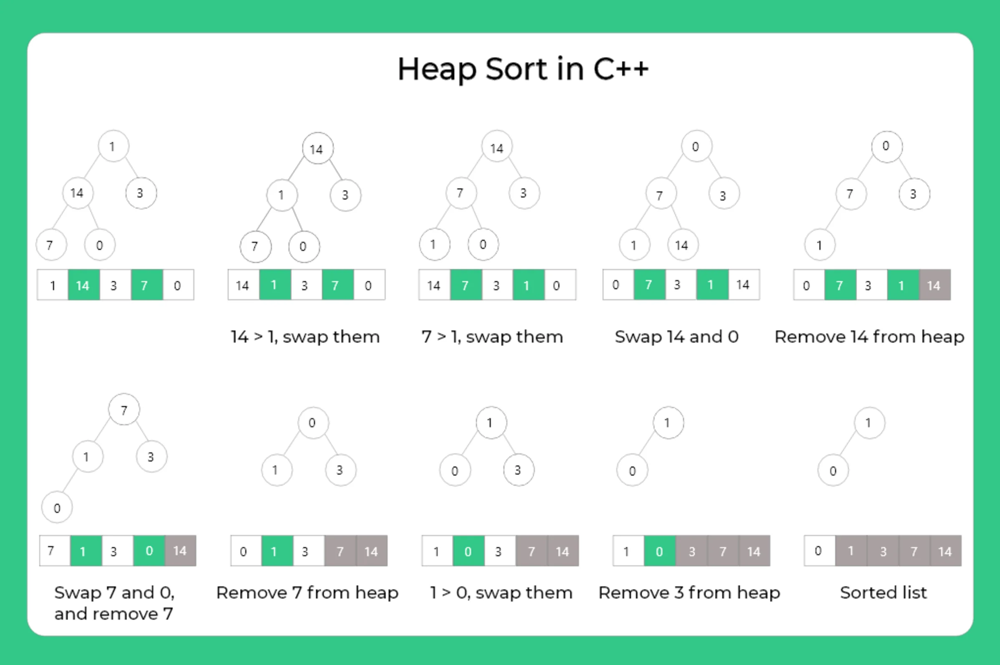

# :heavy_check_mark: Heap Sort
*Last Updated: 1/31/2023*



## :round_pushpin: TLDR
**Time Complexity:** <code>O(N log N)</code>

**Space Complexity:** `O(1)`

## :round_pushpin: Summary
- Comparison-based sorting.
- *Not* a Divide and Conquer algorithm.
- Based on [Binary Heap](../data-structures/non-linear/tree/binary-heap.md) data structure.
- Similar to Selection Sort.
  - Find the first minimum element and place the minimum element at the beginning.
  - Repeat the same process for the remaining elements.
- In-place algorithm.
- Not stable.
- Typically 2-3 times slower than a well-implemented Quick Sort.
  - Due to lack of locality of reference.
- Has limited uses because Quick Sort and Merge Sort are better in practice.
- The Heap data structure itself is enormously used.

## :round_pushpin: Heapify
- Process of creating a heap data structure from a binary tree represented using an array.
- Used to create Min Heap or Max Heap.
- Start from first index of the non-leaf node whose index is given by `N/2 - 1`.
- Uses recursion.

## :round_pushpin: Explanation
- General idea:
  - Convert the array into a heap data structure using heapify.
  - Delete root node one-by-one of the Max Heap and replace it with the last node in the heap.
  - Heapify the root.
  - Repeat the process until size of heap is greater than 1.
- The heapify procedure can only be applied to a node if its children nodes are heapified.
  - So heapification must be performed in a bottom-up order.

## :round_pushpin: Code
This algorithm consists of two phases:
1. The array is converted into a Max Heap.
2. The highest element is removed (root) and the remaining elements are used to create a new Max Heap.

```java
public void sort(int arr[]) {
  // Size of the heap.
  int N = arr.length;

  // Build a Max Heap (rearrange array).
  for (int i = N / 2 - 1; i >= 0; i--) {
    // Pass it the size of the heap.
    // Pass it the root you want to start at.
    // We basically heapfiy from the bottom-most subtree up.
    heapify(arr, N, i);
  }

  // Extract element from heap one by one.
  // Basically moving the largest element to the end of the array on each iteration.
  for (int i = N - 1; i > 0; i--) {
    // Move the current root to the end of the tree.
    int temp = arr[0];
    arr[0] = arr[i];
    arr[i] = temp;

    // Call heapify on the reduced heap starting from the top-most root.
    heapify(arr, i, 0);
  }
}

/*
  Heapify function that heapifies a subtree rooted with node 'i'.
  i:      Index of node (root of subtree).
  arr[]:  Array to be sorted.
  N:      Size of the heap.
*/
public void heapify(int arr[], int N, int i) {
  int largest = i;        // Initialize largest as root.
  int left = 2 * i + 1;   // Index of left child of root.
  int right = 2 * i + 2;  // Index of right child of root.

  // If the left child is larger than the root.
  if (left < N && arr[left] > arr[largest]) {
    largest = left;
  }

  // If the right child is larger than the root.
  if (right < N && arr[right] > arr[largest]) {
    largest = right;
  }

  // If largest is not the root.
  if (largest != i) {
    // Swap largest with the root.
    int swap = arr[i];
    arr[i] = arr[largest];
    arr[largest] = swap;

    // Heapify the subtree rooted at the swapped node (largest).
    // This is in case the node we swapped is smaller than any node below it.
    heapify(arr, N, largest);
  }
}
```
- Basically, we are given an unsorted array.
- Create a max heap with this unsorted array.
  - Create it from the bottom subtree up.
  - So the furthest right subtree will be heapified, then the left sibling, then the parent (and so on).
- The root (arr[0]) will always be the largest value.
- So, swap this root with the end of the array (last element of tree).
- Call heapify on the root.
  - If at any point there is a swap, we call heapify on the root index that we just swapped from.
  - This is because, after swapping, the node that was swapped down might not be a proper heap (i.e. there are elements below it that are greater).
  - This is just recursively heapifying the array.
  - After every swap & proper heapify, we need to decrement the size of the heap by 1.
    - This just means to decrement size counter.
    - You can still access the whole heap.

## :round_pushpin: Merge Sort vs. Heap Sort
- Merge Sort is slightly faster than Heap Sort.
- However, Merge Sort takes extra memory.

## :round_pushpin: Advantages
- Efficiency - The time required to perform Heap Sort increases logarithmically.
- Memory usage is minimal.
- Simpler to understand than other efficient sorting algorithms.

## :round_pushpin: Disadvantages
- Costly.
- Unstable.
- Not efficient when working with highly complex data.

## :round_pushpin: Analysis
**Time Complexity:** <code>O(N log N)</code>

**Space Complexity:** `O(1)`
