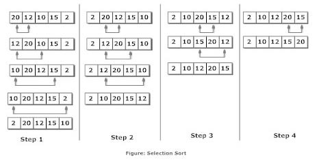

# :heavy_check_mark: Selection Sort
*Last Updated: 1/27/2023*



## :round_pushpin: TLDR
**Time Complexity:** <code>O(N<sup>2</sup>)</code>

**Space Complexity:** `O(1)`

## :round_pushpin: Summary
- In-place sorting algorithm.
- Simple and efficient sorting algorithm.
- Works by repeatedly selecting the smallest (or largest) element from the unsorted portion and moving it to the sorted portion.

## :round_pushpin: Explanation
Simple explanation:
- Think of having playing cards in your right hand.
- You want to sort these cards.
- You skim through your cards and get the smallest card and place it in your left hand (doesn't have to be your left hand as long as it is in a different "pile" that's considered sorted).
- You skim through it again, and again, and again.
- You have no more cards in your right hand, and the cards in your left hand will be sorted.

## :round_pushpin: Code
The code below can be used to sort in descending order as well. Just change the condition.
```java
public void selectionSort(int[] arr) {
  // Grab the length of the array.
  int n = arr.length;

  // Iterate through the array and leave room for one space at the end.
  // When we reach the last element, this will be the largest value by default.
  for (int i = 0; i < n - 1; i++) {
    // Keep track of the index of the smallest value so far.
    int minIndex = i;

    // Iterate through the unsorted portion.
    for (int j = i + 1; j < n; j++) {
      // If we encounter an even smaller minimum, update the minimum value's index.
      if (arr[j] < arr[minIndex]) {
        minIndex = j;
      }
    }

    // After iterating through unsorted, swap the smallest value with the value at position 'i'.
    int temp = arr[minIndex];
    arr[minIndex] = arr[i];
    arr[i] = temp;
  }
}
```
- During each iteration, move the smallest item from the **unsorted** partition and move it to the **sorted** partition.
- The left partition is considered the sorted part.
- The right partition is considered the unsorted part.
- For each number, we iterate through the unsorted part and find the smallest value.
- After, we swap the smallest value with the next available spot in the sorted part.

## :round_pushpin: Analysis
**Time Complexity:** <code>O(N<sup>2</sup>)</code>

**Space Complexity:** `O(1)`
- Selection Sort is not efficient.
- This sorting algorithm is of quadratic time complexity.
- This is similar to Bubble Sort and Insertion Sort.
